# High-Level Architecture - Integrated Flow

**Purpose**: Simple overview of ACOSUS V2 system showing both prediction and training flows in a single diagram.

**Use Case**: Presentation slide 1, stakeholder overview, non-technical audience.

---

## Diagram

```mermaid
graph TB
    subgraph Frontend["🟦 Frontend"]
        SP[Student Portal]
        AP[Admin Portal]
    end

    subgraph Backend["🟩 Backend API"]
        BE[Survey Management<br/>PWRS Calculator<br/>Training Coordinator]
    end

    subgraph ModelServer["🟨 Model Server"]
        MS[Prediction Engine<br/>Training Engine<br/>Model Versioning]
    end

    DB[(🟥 MongoDB)]

    %% Prediction Flow
    SP -->|Factor Survey| BE
    BE -->|Request Prediction| MS
    MS -->|Success Rate| BE
    BE -->|Display + Rating| SP

    %% Training Flow
    AP -->|Create Surveys| BE
    BE -->|Training Data| MS
    MS -->|Train Model<br/>KNN/GAN/NN| MS
    MS -->|Deploy Model| MS

    %% Feedback Loop
    SP -->|Rating ≥4<br/>Pseudo-label| BE
    SP -->|Rating <4<br/>Target Survey| BE

    %% Database
    BE <-->|Store/Retrieve| DB
    MS <-->|Model Metadata| DB

    %% Future Work
    OpenAI[🟪 OpenAI API<br/>Future Work]
    OpenAI -.->|Conversational<br/>Predictions| SP

    classDef frontend fill:#4A90E2,stroke:#2E5C8A,stroke-width:2px,color:#fff
    classDef backend fill:#50C878,stroke:#2E7D4E,stroke-width:2px,color:#fff
    classDef model fill:#F5A623,stroke:#C77F1B,stroke-width:2px,color:#fff
    classDef database fill:#E74C3C,stroke:#A93226,stroke-width:2px,color:#fff
    classDef future fill:#9B59B6,stroke:#6C3483,stroke-width:2px,color:#fff,stroke-dasharray: 5 5

    class SP,AP frontend
    class BE backend
    class MS model
    class DB database
    class OpenAI future
```

---

## Key Features

### Flows Shown
1. **Student Prediction Flow**: Student Portal → Factor Survey → Backend → Model Server → Prediction Display
2. **Admin Training Flow**: Admin Portal → Survey Creation → Backend → Model Server → Model Training
3. **Feedback Loop**: Rating-based decision (pseudo-label vs Target Survey)

### Components
- **Frontend**: Student Portal, Admin Portal
- **Backend**: Survey management, PWRS calculation, training coordination
- **Model Server**: Prediction engine, training engine (KNN/GAN/NN), model versioning
- **Database**: MongoDB (stores surveys, responses, models)
- **Future**: OpenAI API for conversational predictions

### Dual-Survey System
- **Factor Survey**: Always collected (prediction features)
- **Target Survey**: Bootstrap (first 10) + corrections (rating <4)
- **Unified Flow**: Both surveys feed into training data

---

## Speaking Points

**For Presentation**:

> "ACOSUS has a three-tier architecture: Frontend for students and admins, Backend for survey management and coordination, and a Model Server for machine learning predictions and training."

> "The system supports two main workflows: Students complete surveys and receive predictions, while admins create customizable surveys and the system automatically trains models as data grows."

> "The feedback loop is key - if a student rates their prediction as accurate (4+ stars), we use that as training data without requiring additional surveys, reducing burden by 50-70%."

---

**Complexity**: Low (1 slide)
**Audience**: Non-technical stakeholders, quick overview
**Estimated Presentation Time**: 2-3 minutes
