# High-Level Architecture - Side-by-Side Flow

**Purpose**: Simple overview with prediction and training flows shown in parallel.

**Use Case**: Emphasize separation of concerns, show dual-purpose system clearly.

---

## Diagram

```mermaid
graph TB
    subgraph PredictionFlow["🔵 PREDICTION FLOW"]
        direction TB
        SP1[Student Portal]
        FS[Complete Factor Survey]
        PRED[Model Server<br/>Generate Prediction]
        RATE[Display Success Rate<br/>Request Rating]

        SP1 --> FS
        FS --> PRED
        PRED --> RATE

        %% Feedback Decision
        RATE -->|Rating ≥4| PL[Pseudo-label<br/>Training Data]
        RATE -->|Rating <4| TS[Request Target Survey]
    end

    subgraph TrainingFlow["🟡 TRAINING FLOW"]
        direction TB
        AP1[Admin Portal]
        CS[Create Target +<br/>Factor Surveys]
        COLLECT[Collect Survey<br/>Responses]
        TRAIN[Model Server<br/>Train Model]
        DEPLOY[Deploy Updated<br/>Model]

        AP1 --> CS
        CS --> COLLECT
        COLLECT --> TRAIN
        TRAIN --> DEPLOY

        %% Progressive Learning
        TRAIN -->|10-99 students| KNN[KNN Model]
        TRAIN -->|100+ students| GAN[GAN + NN Models]
    end

    subgraph SharedComponents["🟢 SHARED RESOURCES"]
        BE2[Backend API]
        DB2[(MongoDB)]
    end

    %% Connections
    PredictionFlow -.-> BE2
    TrainingFlow -.-> BE2
    BE2 <--> DB2
    PL -.->|Add to training data| COLLECT
    TS -.->|Add to training data| COLLECT

    %% Future Work
    OpenAI2[🟪 OpenAI API<br/>Future Work]
    OpenAI2 -.->|Conversational UI| SP1

    classDef prediction fill:#4A90E2,stroke:#2E5C8A,stroke-width:2px,color:#fff
    classDef training fill:#F5A623,stroke:#C77F1B,stroke-width:2px,color:#fff
    classDef shared fill:#50C878,stroke:#2E7D4E,stroke-width:2px,color:#fff
    classDef decision fill:#95A5A6,stroke:#5D6D7E,stroke-width:2px,color:#fff
    classDef future fill:#9B59B6,stroke:#6C3483,stroke-width:2px,color:#fff,stroke-dasharray: 5 5

    class SP1,FS,PRED,RATE prediction
    class AP1,CS,COLLECT,TRAIN,DEPLOY,KNN,GAN training
    class BE2,DB2 shared
    class PL,TS decision
    class OpenAI2 future
```

---

## Key Features

### Left Side: Prediction Flow
1. Student completes Factor Survey
2. Model Server generates prediction
3. Student rates prediction accuracy
4. **Decision**: Rating ≥4 → Pseudo-label | Rating <4 → Target Survey

### Right Side: Training Flow
1. Admin creates Target + Factor surveys
2. Collect responses (Factor + Target + Pseudo-labels)
3. Model Server trains models based on enrollment count
4. Deploy updated model to prediction flow

### Shared Resources
- **Backend API**: Coordinates both flows
- **MongoDB**: Stores all data (surveys, responses, models)

### Progressive Learning Phases
- **10-99 students**: KNN model
- **100+ students**: GAN augmentation + Neural Network

---

## Speaking Points

**For Presentation**:

> "On the left, we have the prediction flow - transfer students complete a short Factor Survey and receive immediate predictions about their success rate."

> "On the right, the training flow - admins create customizable surveys, and the system automatically collects data and trains models as the transfer student cohort grows."

> "These flows are interconnected through the feedback loop: High-confidence predictions become training data without additional surveys, while low-confidence predictions request the full Target Survey for correction."

> "Notice the progressive learning on the right - we start with KNN for small cohorts (10 students), then automatically upgrade to GAN and Neural Networks as we reach 100+ transfer students."

---

**Complexity**: Low (1 slide)
**Audience**: Technical and non-technical, emphasizes dual workflows
**Estimated Presentation Time**: 3-4 minutes
