# High-Level Architecture - Separate Diagrams

**Purpose**: Two independent diagrams for prediction and training flows, allowing focused discussion of each.

**Use Case**: Separate slides, detailed explanation of each workflow independently.

---

## Diagram 1: Prediction Flow

```mermaid
graph TB
    START([Transfer Student<br/>Enrolls]) --> SP[Student Portal]

    SP --> FS[Complete Factor Survey<br/>7 questions, ~4 min]

    FS --> BE1[Backend API<br/>Survey Management]

    BE1 --> MS1[Model Server<br/>Prediction Engine]

    MS1 -->|PWRS Formula| PRED[Success Rate<br/>e.g., 74%]

    PRED --> DISPLAY[Display to Student<br/>Request Rating]

    DISPLAY --> RATE{Student Rating}

    RATE -->|⭐⭐⭐⭐⭐<br/>4-5 stars| PL[Pseudo-label<br/>Use 74% as training data]
    RATE -->|⭐⭐⭐<br/>1-3 stars| TS[Request Target Survey<br/>Collect actual success rate]

    PL --> DB1[(MongoDB)]
    TS --> DB1

    DB1 -.->|Training Data| TRAIN_REF[See Training Flow]

    %% Future Work
    OpenAI3[🟪 OpenAI API<br/>Future: Conversational Predictions]
    OpenAI3 -.-> SP

    classDef frontend fill:#4A90E2,stroke:#2E5C8A,stroke-width:2px,color:#fff
    classDef backend fill:#50C878,stroke:#2E7D4E,stroke-width:2px,color:#fff
    classDef model fill:#F5A623,stroke:#C77F1B,stroke-width:2px,color:#fff
    classDef decision fill:#E8E8E8,stroke:#7F8C8D,stroke-width:2px,color:#000
    classDef database fill:#E74C3C,stroke:#A93226,stroke-width:2px,color:#fff
    classDef reference fill:#BDC3C7,stroke:#95A5A6,stroke-width:2px,color:#000,stroke-dasharray: 5 5
    classDef future fill:#9B59B6,stroke:#6C3483,stroke-width:2px,color:#fff,stroke-dasharray: 5 5

    class START,SP,FS,DISPLAY frontend
    class BE1 backend
    class MS1,PRED model
    class RATE,PL,TS decision
    class DB1 database
    class TRAIN_REF reference
    class OpenAI3 future
```

### Key Features - Prediction Flow

**Purpose**: Generate success rate predictions for transfer students with minimal survey burden

**Steps**:
1. Transfer student enrolls in ACOSUS
2. Complete Factor Survey (background, academic, financial factors)
3. Backend sends data to Model Server
4. Model Server calculates prediction using PWRS formula
5. Display prediction and request accuracy rating
6. **Intelligent Decision**:
   - High rating (≥4 stars) → Use prediction as pseudo-label (no Target Survey needed)
   - Low rating (<4 stars) → Request Target Survey for ground truth correction

**Data Flow**: All responses stored in MongoDB, pseudo-labels added to training data

**Future Enhancement**: OpenAI API for conversational predictions and chat-based surveys

---

## Diagram 2: Training Flow

### Key Features - Training Flow

**Purpose**: Automatically train and improve ML models as transfer student cohort grows

**Steps**:
1. Admin creates Target and Factor surveys via Admin Portal
2. Backend stores survey templates
3. Collect responses from three sources:
   - Factor Survey responses (all students)
   - Target Survey responses (bootstrap + corrections)
   - Pseudo-labels (high-confidence predictions)
4. **Progressive Learning Decision**:
   - **10-99 transfer students**: Train KNN model (immediate predictions)
   - **100+ transfer students**: Train GAN → Generate synthetic data → Train Neural Network
5. Validate GAN quality (KS test, correlation similarity)
6. Train Neural Network on augmented data
7. **Critical**: Validate NN on REAL transfer students only (never synthetic)
8. Compare NN vs KNN performance
9. Deploy best model with versioning

**Model Versioning**: Track MAE, R², training date, student count for each model

**Automatic Evolution**: System automatically upgrades from KNN to NN as cohort grows

---

## Speaking Points

### For Diagram 1 (Prediction Flow)

> "The prediction flow is designed for minimal transfer student burden. Complete a 7-question Factor Survey in 4 minutes, receive an immediate success rate prediction."

> "The intelligent feedback loop is key: If the transfer student rates their prediction as accurate (4+ stars), we use that as training data without requiring the longer Target Survey. This reduces survey burden by 50-70%."

> "All predictions use the PWRS formula - Priority-Weighted Response Scoring - which is transparent and explainable, not a black box."

### For Diagram 2 (Training Flow)

> "The training flow implements our progressive learning framework. We start predicting with just 10 transfer students using KNN, something commercial systems like Starfish cannot do."

> "As the transfer student cohort grows to 100+, we automatically upgrade to GAN-based data augmentation and Neural Networks, but we always validate on real transfer students only - never synthetic data."

> "Model versioning ensures we only deploy improved models. If the Neural Network doesn't outperform KNN, we keep using KNN. The system is patient and evidence-based."

---

## Cross-References

- **Prediction Flow** feeds training data to **Training Flow** via pseudo-labels and Target Survey responses
- **Training Flow** deploys models that power **Prediction Flow** predictions
- Both flows share **Backend API** and **MongoDB** as central coordination and storage

---

**Complexity**: Low (2 separate slides)
**Audience**: Allows detailed discussion of each workflow independently
**Estimated Presentation Time**: 5-6 minutes (3 min per diagram)
