# Medium-Level Architecture - Integrated Flow

**Purpose**: Show key backend services and model server components with both prediction and training flows integrated.

**Use Case**: Technical presentation for committee, developer documentation.

---

## Diagram

```mermaid
graph TB
    subgraph Frontend["🟦 FRONTEND"]
        SP[Student Portal<br/>Enrollment, Surveys, Results]
        AP[Admin Portal<br/>Survey Builder, Config]
    end

    subgraph Backend["🟩 BACKEND API"]
        SM[Survey Management<br/>Store/Retrieve Templates]
        PWRS[PWRS Calculator<br/>Priority-Weighted Scoring]
        TRB[Training Request Builder<br/>Format Training Data]
        FBL[Feedback Loop Logic<br/>Rating Threshold Check]
    end

    subgraph ModelServer["🟨 MODEL SERVER"]
        DN[Data Normalizer<br/>Features → 0-10 Scale]
        MS_SEL[Model Selector<br/>Phase Detection]
        PE[Prediction Engine<br/>KNN/NN Inference]
        TQM[Training Queue Manager<br/>Async Job Handling]
        MV[Model Versioning<br/>Performance Tracking]

        subgraph TrainingEngines["Training Engines"]
            KNN_T[KNN Trainer<br/>k=3, distance-weighted]
            GAN_T[GAN Trainer<br/>Data Augmentation]
            NN_T[NN Trainer<br/>Feedforward Network]
        end
    end

    DB[(🟥 MongoDB<br/>Surveys, Responses,<br/>Models, Metadata)]

    %% PREDICTION FLOW
    SP -->|Factor Survey| SM
    SM -->|Survey Data| PWRS
    PWRS -->|Normalized Data| DN
    DN -->|Features| MS_SEL
    MS_SEL -->|Select Model| PE
    PE -->|Success Rate| PWRS
    PWRS -->|Display| SP

    %% FEEDBACK LOOP
    SP -->|Rating| FBL
    FBL -->|Rating ≥4<br/>Pseudo-label| SM
    FBL -->|Rating <4<br/>Target Survey| SP

    %% TRAINING FLOW
    AP -->|Create Surveys| SM
    SM -->|Survey Templates| DB
    SM -->|Training Data| TRB
    TRB -->|Format Request| TQM

    %% PROGRESSIVE LEARNING
    TQM -->|n=10-99| KNN_T
    TQM -->|n=100+| GAN_T
    GAN_T -->|Synthetic Data| NN_T

    %% MODEL DEPLOYMENT
    KNN_T -->|Deploy| MV
    NN_T -->|Deploy| MV
    MV -->|Track Performance| DB
    MV -->|Model Available| MS_SEL

    %% DATABASE CONNECTIONS
    SM <-->|Store/Retrieve| DB
    TRB <-->|Query Training Data| DB
    DN <-->|Feature Scaling Config| DB

    %% FUTURE WORK
    OpenAI[🟪 OpenAI API<br/>Future: Conversational<br/>Predictions & Surveys]
    OpenAI -.->|Integration Point| SP

    classDef frontend fill:#4A90E2,stroke:#2E5C8A,stroke-width:2px,color:#fff
    classDef backend fill:#50C878,stroke:#2E7D4E,stroke-width:2px,color:#fff
    classDef model fill:#F5A623,stroke:#C77F1B,stroke-width:2px,color:#fff
    classDef training fill:#FF6B6B,stroke:#C0392B,stroke-width:2px,color:#fff
    classDef database fill:#E74C3C,stroke:#A93226,stroke-width:2px,color:#fff
    classDef future fill:#9B59B6,stroke:#6C3483,stroke-width:2px,color:#fff,stroke-dasharray: 5 5

    class SP,AP frontend
    class SM,PWRS,TRB,FBL backend
    class DN,MS_SEL,PE,TQM,MV model
    class KNN_T,GAN_T,NN_T training
    class DB database
    class OpenAI future
```

---

## Component Descriptions

### Frontend Components

#### Student Portal
- **Enrollment Form**: Collect basic transfer student information
- **Survey Interface**: Render Factor and Target surveys
- **Prediction Display**: Show success rate with visual indicators
- **Rating UI**: 5-star rating system for prediction accuracy
- **Survey History**: View past responses and predictions

#### Admin Portal
- **Survey Builder**: Create/edit Target and Factor surveys
- **Model Configuration**: Set training parameters, thresholds
- **Dashboard**: View enrollment count, model performance, system metrics
- *Future*: Advisor dashboard for transfer student cohort tracking

---

### Backend Components

#### Survey Management
- **Store Templates**: Save Target and Factor survey definitions
- **Retrieve Surveys**: Send appropriate survey to student based on context
- **Store Responses**: Save Factor, Target, and pseudo-label data
- **Query Training Data**: Aggregate all labeled data for training requests

#### PWRS Calculator
- **Formula**: `successRate = Σ(priority_i × response_i) / Σ(priority_i)`
- **Input**: Survey responses (questions with priority weights)
- **Output**: Success rate (0-100%)
- **Use Cases**: Calculate Target Survey success rate, normalize predictions

#### Training Request Builder
- **Query MongoDB**: Collect all training data (Factor + Target + Pseudo-labels)
- **Format Data**: Structure for Model Server API
- **Check Enrollment**: Determine phase (KNN vs GAN/NN)
- **Send Request**: POST to Model Server training endpoint

#### Feedback Loop Logic
- **Rating Threshold**: Check if rating ≥ 4.0 stars
- **Pseudo-label Creation**: If rating ≥4, store `{studentId, factors, predictedSuccess, isPseudoLabel: true}`
- **Target Survey Request**: If rating <4, redirect student to Target Survey
- **Data Quality**: Track pseudo-label rate, rating distribution

---

### Model Server Components

#### Data Normalizer
- **Purpose**: Normalize all features to 0-10 scale for consistent model input
- **Scaling Methods**:
  - Min-Max: GPA (0-4) → (0-10)
  - Categorical Encoding: Yes/No → 10/0
  - Ordinal Mapping: Likert scales (1-5) → (2, 4, 6, 8, 10)
- **Store Config**: Save normalization parameters for consistency

#### Model Selector
- **Phase Detection**: Query enrollment count from MongoDB
- **Model Selection**:
  - `n < 10`: No model available (bootstrap phase)
  - `10 ≤ n < 100`: Use KNN model
  - `n ≥ 100`: Use NN model (if validated), else KNN
- **Version Management**: Load latest model version from Model Versioning

#### Prediction Engine
- **KNN Inference**: Find k=3 nearest neighbors, distance-weighted average
- **NN Inference**: Forward pass through trained Neural Network
- **Output**: Raw prediction (0-1 scale) → PWRS Calculator converts to success rate (0-100%)

#### Training Queue Manager
- **Async Job Queue**: Handle training requests without blocking prediction API
- **Job Prioritization**: FIFO (First In, First Out)
- **Status Tracking**: In-progress, completed, failed jobs
- **Notifications**: Send training completion status to Backend

#### Model Versioning
- **Store Models**: Save trained KNN and NN models with metadata
- **Metadata Tracked**:
  - `modelId`, `phase` (KNN/NN), `trainingDate`, `studentCount`
  - Performance: `MAE`, `R²`, `RMSE` (on validation set)
- **Rollback Support**: Revert to previous model if new model underperforms
- **Deployment Logic**: Only deploy if `new_MAE < old_MAE`

---

### Training Engines

#### KNN Trainer
- **Algorithm**: K-Nearest Neighbors (k=3, distance-weighted)
- **Training**: Store all labeled samples (no actual training phase - lazy learning)
- **Validation**: 5-fold cross-validation on available data
- **Expected Performance**: MAE ~12-14, R² ~0.42-0.54

#### GAN Trainer
- **Purpose**: Generate synthetic transfer students for NN training
- **Input**: 100 real transfer students
- **Output**: 400 synthetic students (total 500 for NN training)
- **Architecture**:
  - Generator: Latent vector (100-dim) → 7 features (Factor Survey)
  - Discriminator: 7 features → Real/Fake classification
- **Validation**: KS test (p >0.05), correlation similarity (<0.2 difference)

#### NN Trainer
- **Input**: 100 real + 400 synthetic transfer students
- **Architecture**: Input(7) → Dense(64, ReLU) → Dropout(0.3) → Dense(32, ReLU) → Output(1, Sigmoid)
- **Training**: 80% train, 20% validation (REAL students only in validation set)
- **Loss**: Mean Squared Error (MSE)
- **Expected Performance**: MAE ~9, R² ~0.71

---

## Key Flows

### Prediction Flow (Student Perspective)
1. **Enrollment**: Student enrolls → Complete Factor Survey
2. **Backend Processing**: Survey Management → PWRS Calculator → Data Normalizer
3. **Model Inference**: Model Selector → Prediction Engine → Success Rate
4. **Feedback**: Display prediction → Student rates → Feedback Loop Logic
5. **Decision**: Rating ≥4 → Pseudo-label | Rating <4 → Target Survey

### Training Flow (Admin Perspective)
1. **Survey Creation**: Admin creates Target + Factor surveys → Survey Management
2. **Data Collection**: Students complete surveys → Store in MongoDB
3. **Training Request**: Training Request Builder queries data → Send to Model Server
4. **Progressive Training**:
   - **Phase 1 (10-99)**: KNN Trainer → Deploy KNN
   - **Phase 2 (100+)**: GAN Trainer → Generate synthetic → NN Trainer → Validate → Deploy NN
5. **Versioning**: Model Versioning tracks performance → Deploy best model

### Feedback Loop (Dual-Survey Integration)
1. **Factor Survey**: Always collected (prediction features)
2. **Target Survey**:
   - **Bootstrap** (first 10): REQUIRED
   - **Corrections** (rating <4): REQUIRED
   - **Pseudo-labels** (rating ≥4): SKIP (use prediction as label)
3. **Training Data**: Factor + Target + Pseudo-labels → Training Request Builder

---

## Speaking Points

**For Presentation**:

> "The backend has four key services: Survey Management for storing and retrieving surveys, PWRS Calculator for transparent success rate calculations, Training Request Builder for coordinating model updates, and Feedback Loop Logic for intelligent pseudo-labeling."

> "The Model Server contains five components: Data Normalizer ensures all features are on the same 0-10 scale, Model Selector automatically chooses KNN or NN based on enrollment count, Prediction Engine runs inference, Training Queue Manager handles async training jobs, and Model Versioning tracks performance metrics."

> "Notice the progressive learning on the right: With 10-99 transfer students, we use the KNN Trainer. At 100+ students, we activate the GAN Trainer to generate synthetic data, then train a Neural Network. The system automatically evolves as the cohort grows."

> "The feedback loop is intelligent: High-confidence predictions (rated 4+ stars) become pseudo-labels, reducing survey burden by 50-70%. Low-confidence predictions request the Target Survey for correction, maintaining data quality."

---

**Complexity**: Medium (1-2 slides)
**Audience**: Technical committee members, developers
**Estimated Presentation Time**: 5-7 minutes
