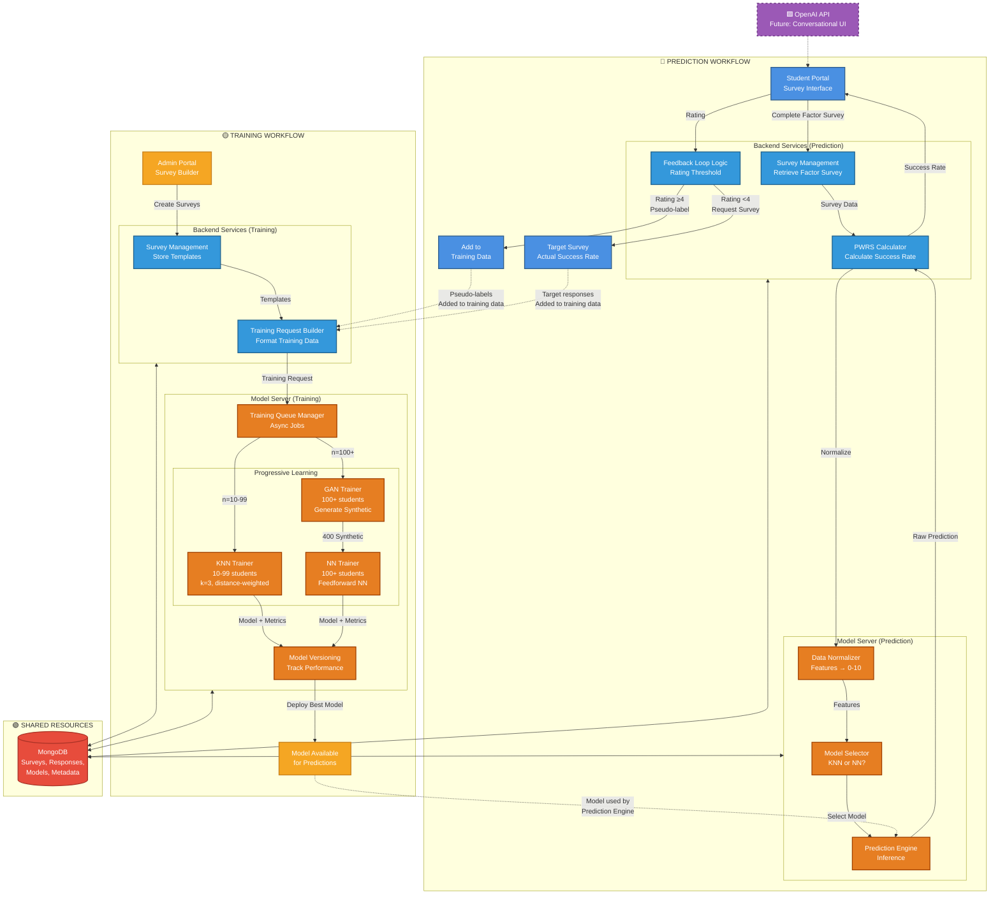

# Medium-Level Architecture - Side-by-Side Flow

**Purpose**: Show prediction and training flows in parallel with backend service details.

**Use Case**: Emphasize workflow separation while showing shared components.

---

## Diagram

---

## Left Side: Prediction Workflow (Detail)

### Student Journey
1. **Survey Completion**: Student opens Student Portal → Complete Factor Survey (7 questions, ~4 min)
2. **Backend Processing**:
   - **Survey Management**: Retrieve Factor Survey template from MongoDB
   - **PWRS Calculator**: Calculate normalized success rate
3. **Model Inference**:
   - **Data Normalizer**: Convert features to 0-10 scale (GPA, hours, confidence levels, etc.)
   - **Model Selector**: Query enrollment count → Select KNN or NN model
   - **Prediction Engine**: Run inference (KNN finds similar students, NN forward pass)
4. **Display Result**: Show success rate to student with visual indicator
5. **Feedback Collection**: Student rates prediction accuracy (1-5 stars)

### Feedback Loop Decision
- **Path A (Rating ≥4)**:
  - Feedback Loop Logic marks as pseudo-label
  - Store: `{studentId, factors[], predictedSuccess, isPseudoLabel: true, rating}`
  - Add to training data (flows to Training Workflow)
  - **Result**: Student done in ~5 minutes total

- **Path B (Rating <4)**:
  - Feedback Loop Logic requests Target Survey
  - Student completes Target Survey (5-10 questions, ~10 min)
  - Store actual success rate
  - Add to training data (flows to Training Workflow)
  - **Result**: Student done in ~15 minutes total

### Backend Services (Prediction)

**Survey Management**:
- Retrieve appropriate survey based on context (Factor vs Target)
- Store responses with timestamps
- Handle duplicate submission prevention

**PWRS Calculator**:
- Apply priority weights to survey responses
- Formula: `Σ(priority_i × response_i) / Σ(priority_i)`
- Convert to 0-100% success rate

**Feedback Loop Logic**:
- Rating threshold check (4.0 stars)
- Pseudo-label creation and storage
- Track pseudo-label rate (target: 50-70%)

### Model Server (Prediction)

**Data Normalizer**:
- Consistent feature scaling (0-10 range)
- Handle missing values (median imputation)
- Store normalization config for reproducibility

**Model Selector**:
- Automatic phase detection based on enrollment count
- Load latest model version from Model Versioning
- Fallback to KNN if NN unavailable

**Prediction Engine**:
- KNN: Find k=3 similar students, distance-weighted average
- NN: Forward pass through trained network
- Return raw prediction (0-1 scale)

---

## Right Side: Training Workflow (Detail)

### Admin Journey
1. **Survey Creation**: Admin logs into Admin Portal → Survey Builder
2. **Template Design**:
   - **Target Survey**: Questions that measure success (GPA expectations, confidence, career readiness)
   - **Factor Survey**: Features that predict success (background, resources, motivation)
3. **Backend Storage**: Survey Management stores templates in MongoDB
4. **Training Trigger**: Training Request Builder aggregates data and sends training request

### Data Collection Sources
1. **Factor Survey**: Collected from all students (required)
2. **Target Survey**: Collected from:
   - First 10 students (bootstrap phase - REQUIRED)
   - Students who rate predictions <4 stars (corrections)
3. **Pseudo-labels**: Students who rate predictions ≥4 stars (50-70% of students)

### Progressive Learning Flow

**Training Request Builder**:
- Query MongoDB for all labeled data: `Factor responses + Target responses + Pseudo-labels`
- Check enrollment count: `SELECT COUNT(*) FROM students`
- Format training data: Normalize features, prepare labels
- POST to Model Server training endpoint

**Training Queue Manager**:
- Receive training request
- Add to async job queue (prevents blocking prediction API)
- Determine phase based on student count:
  - `10 ≤ n < 100`: Route to KNN Trainer
  - `n ≥ 100`: Route to GAN Trainer → NN Trainer

**Phase 1: KNN Trainer (10-99 students)**:
- Store all labeled samples (lazy learning - no actual training)
- Set k=3, distance-weighted
- Validate: 5-fold cross-validation
- Expected: MAE ~12, R² ~0.50
- Send model + metrics to Model Versioning

**Phase 2: GAN + NN Trainers (100+ students)**:
- **GAN Trainer**:
  - Input: 100 real transfer students
  - Train Generator + Discriminator
  - Generate 400 synthetic students
  - Validate: KS test (p >0.05), correlation similarity (<0.2)

- **NN Trainer**:
  - Input: 100 real + 400 synthetic (total 500)
  - Architecture: Input(7) → Dense(64) → Dense(32) → Output(1)
  - Train: 80% train (real + synthetic), 20% validation (REAL ONLY)
  - Expected: MAE ~9, R² ~0.71
  - Send model + metrics to Model Versioning

**Model Versioning**:
- Store model with metadata: `{modelId, phase, MAE, R², trainingDate, studentCount}`
- Compare to previous model: `if new_MAE < old_MAE: deploy`
- Rollback support: Keep previous models for safety
- Model Available → Flows back to Prediction Workflow

---

## Shared Resources

### MongoDB
**Collections** (not shown in diagram, but stored):
- `surveys`: Target and Factor survey templates
- `responses`: Student survey responses
- `pseudoLabels`: High-confidence predictions used as labels
- `models`: Trained model files and metadata
- `trainingJobs`: Training queue status

**Connections**:
- Backend Prediction ↔ MongoDB: Store/retrieve surveys and responses
- Backend Training ↔ MongoDB: Query training data
- Model Server Prediction ↔ MongoDB: Load model versions
- Model Server Training ↔ MongoDB: Store trained models and metadata

---

## Integration Points

### Feedback Loop → Training Data
- **Pseudo-labels** from Prediction Workflow added to **Training Request Builder** in Training Workflow
- **Target Survey** responses from Prediction Workflow added to **Training Request Builder** in Training Workflow
- This creates a continuous improvement loop: Better predictions → More pseudo-labels → More training data → Better models

### Trained Models → Prediction Engine
- **Model Versioning** in Training Workflow deploys models used by **Model Selector** in Prediction Workflow
- Automatic model updates: System seamlessly switches from KNN to NN when available
- No downtime: Old model serves predictions while new model trains

---

## Speaking Points

**For Presentation**:

> "On the left, the prediction workflow: Transfer students complete a short Factor Survey, the backend processes it through the PWRS Calculator and Data Normalizer, the Model Server selects the appropriate model and generates a prediction, then the student rates the accuracy."

> "The feedback loop is critical: If the rating is 4+ stars, we use that prediction as a pseudo-label - no Target Survey needed. If the rating is low, we request the Target Survey to correct the model. This reduces survey burden by 50-70%."

> "On the right, the training workflow: Admins create customizable surveys, students complete them, and the Training Request Builder aggregates all data - Factor responses, Target responses, and pseudo-labels from the prediction flow."

> "Notice the progressive learning: With 10-99 students, we train a simple KNN model. At 100+ students, we activate GAN-based data augmentation to generate synthetic students, then train a Neural Network. The system automatically evolves."

> "These workflows are tightly integrated: Pseudo-labels from prediction flow into training, and trained models flow back to power predictions. MongoDB serves as the central hub for all data and model storage."

---

**Complexity**: Medium (1-2 slides)
**Audience**: Technical committee, emphasizes workflow separation and integration
**Estimated Presentation Time**: 6-8 minutes
