# Medium-Level Architecture - Separate Diagrams

**Purpose**: Two detailed diagrams for prediction and training workflows with backend service visibility.

**Use Case**: Separate slides for focused discussion, developer documentation.

---

## Diagram 1: Prediction Workflow (Medium Detail)

```mermaid
graph TB
    START([Transfer Student Enrolls]) --> SP[Student Portal]

    SP --> ENROLL[Complete Enrollment Form]

    ENROLL --> GET_SURVEY[Backend: Survey Management<br/>Retrieve Factor Survey]

    GET_SURVEY --> FS[Display Factor Survey<br/>7 questions, ~4 min]

    FS --> SUBMIT[Student Submits Responses]

    SUBMIT --> STORE_RESP[Backend: Survey Management<br/>Store Factor Responses]

    STORE_RESP --> PWRS[Backend: PWRS Calculator<br/>Prepare for Prediction]

    PWRS --> NORM[Model Server: Data Normalizer<br/>Features → 0-10 Scale]

    NORM --> SEL[Model Server: Model Selector<br/>Query Enrollment Count]

    SEL -->|n=10-99| KNN_PRED[Use KNN Model]
    SEL -->|n≥100| NN_PRED[Use NN Model]

    KNN_PRED --> ENGINE[Model Server: Prediction Engine]
    NN_PRED --> ENGINE

    ENGINE --> RAW[Raw Prediction<br/>0-1 Scale]

    RAW --> CONVERT[Backend: PWRS Calculator<br/>Convert to Success Rate 0-100%]

    CONVERT --> DISPLAY[Display to Student<br/>"Your predicted success rate: 74%"]

    DISPLAY --> RATE[Request Accuracy Rating<br/>⭐⭐⭐⭐⭐]

    RATE --> FBL{Feedback Loop Logic<br/>Rating Check}

    FBL -->|Rating ≥4<br/>High Confidence| PL[Create Pseudo-label<br/>Store: studentId, factors,<br/>predictedSuccess=74%, isPseudoLabel=true]

    FBL -->|Rating <4<br/>Low Confidence| TS_REQ[Request Target Survey<br/>Collect Actual Success Rate]

    PL --> DB1[(MongoDB)]
    TS_REQ --> TS_COMPLETE[Student Completes Target Survey]
    TS_COMPLETE --> DB1

    DB1 -.->|Training Data<br/>See Training Workflow| TRAIN_REF[Factor + Target + Pseudo-labels]

    %% Future Work
    OpenAI1[🟪 OpenAI API<br/>Future Work:<br/>- Conversational predictions<br/>- Chat-based surveys<br/>- Explanation generation]
    OpenAI1 -.-> SP

    %% Annotations
    NOTE1[Survey Burden Reduction:<br/>50-70% of students skip Target Survey<br/>Average time: 5 min vs 15 min]
    FBL -.-> NOTE1

    classDef frontend fill:#4A90E2,stroke:#2E5C8A,stroke-width:2px,color:#fff
    classDef backend fill:#50C878,stroke:#2E7D4E,stroke-width:2px,color:#fff
    classDef model fill:#F5A623,stroke:#C77F1B,stroke-width:2px,color:#fff
    classDef decision fill:#E8E8E8,stroke:#7F8C8D,stroke-width:2px,color:#000
    classDef database fill:#E74C3C,stroke:#A93226,stroke-width:2px,color:#fff
    classDef reference fill:#BDC3C7,stroke:#95A5A6,stroke-width:2px,color:#000,stroke-dasharray: 5 5
    classDef annotation fill:#FCF3CF,stroke:#F39C12,stroke-width:2px,color:#000
    classDef future fill:#9B59B6,stroke:#6C3483,stroke-width:2px,color:#fff,stroke-dasharray: 5 5

    class START,SP,ENROLL,FS,SUBMIT,DISPLAY,RATE,TS_COMPLETE frontend
    class GET_SURVEY,STORE_RESP,PWRS,CONVERT backend
    class NORM,SEL,KNN_PRED,NN_PRED,ENGINE,RAW model
    class FBL,PL,TS_REQ decision
    class DB1 database
    class TRAIN_REF reference
    class NOTE1 annotation
    class OpenAI1 future
```

### Component Details - Prediction Workflow

#### Frontend (Student Portal)
**Enrollment Form**:
- Collect: Name, Email, Student ID, Transfer status
- Transfer-specific: Previous institution, credits transferred, GPA from previous institution

**Factor Survey Interface**:
- 7 questions across 5 categories:
  1. Academic Confidence (GPA expectations, course difficulty)
  2. Motivation & Career Goals (career clarity, commitment)
  3. Personal Attributes (time management, stress resilience)
  4. Resources & Support (financial support, family support, commute)
  5. Self-Assessment (transfer readiness, institutional fit)
- Estimated completion time: 4 minutes

**Prediction Display**:
- Visual success rate: Progress bar, color-coded (red <50%, yellow 50-75%, green >75%)
- Interpretation: "You have a 74% predicted success rate based on similar transfer students"
- Similar students: "Your profile matches transfer students #3, #7, #12"

**Rating UI**:
- 5-star rating system
- Prompt: "How accurate do you think this prediction is for you?"
- Optional comment field

#### Backend Services

**Survey Management**:
- **Retrieve Survey**: Query MongoDB for Factor Survey template
- **Store Responses**: Save with timestamp, student ID, response metadata
- **Duplicate Prevention**: Check if student already submitted Factor Survey
- **Survey Versioning**: Track which survey version student completed

**PWRS Calculator**:
- **For Predictions**: Prepare normalized data for Model Server
- **For Target Survey**: Calculate actual success rate using priority-weighted formula
- **Formula**: `successRate = Σ(priority_i × response_i) / Σ(priority_i)`
- **Example**:
  ```
  Q1: "Expected GPA?" Response: 3.5/4.0, Priority: 10 → Contribution: 35
  Q2: "Course difficulty?" Response: 7/10, Priority: 8 → Contribution: 56
  Total: (35 + 56 + ...) / (10 + 8 + ...) = 74%
  ```

**Feedback Loop Logic**:
- **Rating Threshold**: 4.0 stars (adjustable by admin)
- **Pseudo-label Creation**:
  ```json
  {
    "studentId": "12345",
    "factors": [8, 7, 6, 9, 7, 8, 7],
    "predictedSuccess": 74,
    "isPseudoLabel": true,
    "rating": 4.5,
    "timestamp": "2026-01-15T10:30:00Z"
  }
  ```
- **Track Metrics**:
  - Pseudo-label rate: % of students with rating ≥4
  - Average rating by prediction range (0-50%, 50-75%, 75-100%)
  - Survey burden reduction: Average time per student

#### Model Server Components

**Data Normalizer**:
- **Input**: Raw Factor Survey responses
- **Processing**:
  - GPA (0-4) → (0-10): `normalized = (gpa / 4) * 10`
  - Hours worked (0-40) → (0-10): `normalized = (hours / 40) * 10`
  - Likert (1-5) → (0-10): `normalized = ((response - 1) / 4) * 10`
  - Yes/No → 10/0
- **Output**: Normalized feature vector `[8.0, 7.5, 6.0, 9.0, 7.0, 8.5, 7.0]`
- **Store Config**: Save min/max values for consistency

**Model Selector**:
- **Query**: `SELECT COUNT(*) FROM students WHERE hasTargetOrPseudoLabel = true`
- **Decision**:
  - `count < 10`: Return error "Model not ready - bootstrap phase"
  - `10 ≤ count < 100`: Load KNN model
  - `count ≥ 100`: Check if NN exists and validated → Load NN, else load KNN
- **Version Loading**: Get latest model from Model Versioning collection

**Prediction Engine**:
- **KNN Inference** (if n=10-99):
  - Find k=3 nearest neighbors using Euclidean distance
  - Calculate distance-weighted average:
    ```python
    weights = [1/d1, 1/d2, 1/d3]
    prediction = (w1*s1 + w2*s2 + w3*s3) / (w1 + w2 + w3)
    ```
  - Return prediction (0-1 scale)

- **NN Inference** (if n≥100):
  - Forward pass through trained network
  - Input: Normalized features (7 dimensions)
  - Architecture: Input(7) → Dense(64) → Dense(32) → Output(1)
  - Return prediction (0-1 scale, sigmoid output)

---

## Diagram 2: Training Workflow (Medium Detail)

```mermaid
graph TB
    START2([Admin Portal]) --> CREATE[Survey Builder<br/>Create Target + Factor Surveys]

    CREATE --> DESIGN{Survey Type}

    DESIGN -->|Target Survey| TARGET_DESIGN[Design Questions that<br/>Measure Success:<br/>- GPA expectations<br/>- Confidence levels<br/>- Career readiness]

    DESIGN -->|Factor Survey| FACTOR_DESIGN[Design Questions that<br/>Predict Success:<br/>- Background<br/>- Resources<br/>- Motivation]

    TARGET_DESIGN --> STORE[Backend: Survey Management<br/>Store Templates in MongoDB]
    FACTOR_DESIGN --> STORE

    STORE --> COLLECT[Data Collection Phase<br/>Students Complete Surveys]

    COLLECT --> SOURCES{Data Sources}

    SOURCES -->|All Students| FACTOR_RESP[Factor Survey Responses]
    SOURCES -->|Bootstrap n=1-10| TARGET_RESP1[Target Survey Responses<br/>REQUIRED]
    SOURCES -->|Rating ≥4| PSEUDO_RESP[Pseudo-labels<br/>50-70% of students]
    SOURCES -->|Rating <4| TARGET_RESP2[Target Survey Responses<br/>Corrections]

    FACTOR_RESP --> TRB[Backend: Training Request Builder]
    TARGET_RESP1 --> TRB
    PSEUDO_RESP --> TRB
    TARGET_RESP2 --> TRB

    TRB --> FORMAT[Format Training Data:<br/>- Query MongoDB for all labeled data<br/>- Combine Factor + Target + Pseudo-labels<br/>- Check enrollment count]

    FORMAT --> REQUEST[POST to Model Server<br/>/train endpoint]

    REQUEST --> TQM[Model Server: Training Queue Manager<br/>Add to Async Job Queue]

    TQM --> PHASE{Enrollment Count}

    PHASE -->|10 ≤ n < 100| KNN_TRAIN[KNN Trainer<br/>Phase 1: Bootstrap]
    PHASE -->|n ≥ 100| GAN_TRAIN[GAN Trainer<br/>Phase 2: Augmentation]

    KNN_TRAIN --> KNN_STEPS[Training Steps:<br/>1. Store all labeled samples<br/>2. Set k=3, distance-weighted<br/>3. Validate: 5-fold cross-validation<br/>4. Calculate: MAE, R², RMSE]

    GAN_TRAIN --> GAN_STEPS[Training Steps:<br/>1. Train Generator + Discriminator<br/>2. Generate 400 synthetic students<br/>3. Validate: KS test p>0.05<br/>4. Check correlation similarity <0.2]

    GAN_STEPS --> NN_TRAIN[NN Trainer<br/>Phase 3: Neural Network]

    NN_TRAIN --> NN_STEPS[Training Steps:<br/>1. Input: 100 real + 400 synthetic<br/>2. Split: 80% train, 20% validation<br/>3. CRITICAL: Validation set = REAL ONLY<br/>4. Train: MSE loss, Adam optimizer<br/>5. Validate: MAE, R² on real students]

    KNN_STEPS --> MV[Model Server: Model Versioning]
    NN_STEPS --> MV

    MV --> COMPARE{Performance Check}

    COMPARE -->|New Model Better| DEPLOY[Deploy New Model<br/>Update Model Selector]
    COMPARE -->|Old Model Better| KEEP[Keep Current Model<br/>Log Training Failure]

    DEPLOY --> VERSION_STORE[(MongoDB: models Collection<br/>Store: modelId, phase, MAE, R²,<br/>trainingDate, studentCount, filePath)]

    KEEP --> VERSION_STORE

    VERSION_STORE -.->|Model Available<br/>See Prediction Workflow| PRED_REF[Model Selector loads<br/>latest model version]

    %% Annotations
    NOTE2[Progressive Learning:<br/>System automatically evolves<br/>KNN → GAN → NN<br/>as cohort grows]
    PHASE -.-> NOTE2

    NOTE3[Validation Principle:<br/>NEVER validate on synthetic data<br/>Only real students in validation set]
    NN_STEPS -.-> NOTE3

    classDef admin fill:#9B59B6,stroke:#6C3483,stroke-width:2px,color:#fff
    classDef backend fill:#50C878,stroke:#2E7D4E,stroke-width:2px,color:#fff
    classDef model fill:#F5A623,stroke:#C77F1B,stroke-width:2px,color:#fff
    classDef decision fill:#E8E8E8,stroke:#7F8C8D,stroke-width:2px,color:#000
    classDef database fill:#E74C3C,stroke:#A93226,stroke-width:2px,color:#fff
    classDef steps fill:#AED6F1,stroke:#2874A6,stroke-width:2px,color:#000
    classDef reference fill:#BDC3C7,stroke:#95A5A6,stroke-width:2px,color:#000,stroke-dasharray: 5 5
    classDef annotation fill:#FCF3CF,stroke:#F39C12,stroke-width:2px,color:#000

    class START2,CREATE,TARGET_DESIGN,FACTOR_DESIGN admin
    class STORE,TRB,FORMAT,REQUEST backend
    class TQM,KNN_TRAIN,GAN_TRAIN,NN_TRAIN,MV,DEPLOY,KEEP model
    class DESIGN,SOURCES,PHASE,COMPARE decision
    class VERSION_STORE database
    class KNN_STEPS,GAN_STEPS,NN_STEPS steps
    class PRED_REF reference
    class NOTE2,NOTE3 annotation
```



### Component Details - Training Workflow

#### Admin Portal

**Survey Builder**:
- **Target Survey Creation**:
  - Two types supported:
    1. **Single-question**: "What is your expected success rate?" (0-100%)
    2. **Multi-question**: 5-10 questions with priority weights → PWRS formula
  - Question types: Likert scale, multiple choice, slider, yes/no
  - Priority weighting: Assign importance to each question (1-10)

- **Factor Survey Creation**:
  - Design features that predict success (WITHOUT asking about success)
  - Categories: Academic, Financial, Personal, Resources, Self-Assessment
  - Transfer-specific factors supported: Credits lost, previous institution type, GPA change

**Model Configuration**:
- Set training parameters: Batch size, learning rate, epochs
- Set feedback threshold: Minimum rating for pseudo-labels (default: 4.0)
- Set training trigger: Auto-train after N new students (default: 10)

#### Backend Services

**Survey Management**:
- **Store Templates**: Save Target and Factor survey definitions with versioning
- **Track Survey Usage**: Which students completed which survey version
- **Survey Analytics**: Completion rates, average time, dropout points

**Training Request Builder**:
- **Query Training Data**:
  ```sql
  SELECT * FROM responses WHERE
    (hasTargetSurvey = true) OR
    (isPseudoLabel = true AND rating >= 4.0)
  ```
- **Format Request**:
  ```json
  {
    "studentCount": 105,
    "features": [[8,7,6,9,7,8,7], [6,8,7,5,9,7,8], ...],
    "labels": [74, 82, 65, ...],
    "requestId": "train-20260115-001",
    "timestamp": "2026-01-15T14:00:00Z"
  }
  ```
- **Send to Model Server**: POST /train with formatted data

#### Model Server Components

**Training Queue Manager**:
- **Job Queue**: FIFO (First In, First Out) async queue
- **Job Tracking**:
  ```json
  {
    "jobId": "train-20260115-001",
    "status": "in_progress",
    "startTime": "2026-01-15T14:00:00Z",
    "studentCount": 105,
    "phase": "NN"
  }
  ```
- **Concurrency**: Single training job at a time (prevent resource conflicts)
- **Notification**: Send completion status to Backend API

**KNN Trainer** (Phase 1: 10-99 students):
- **Training**:
  - Store all labeled samples (lazy learning)
  - No actual model training required
  - Set hyperparameters: k=3, distance metric=Euclidean, weighting=distance-weighted
- **Validation**:
  - 5-fold cross-validation on available data
  - Calculate: MAE, R², RMSE
  - Expected performance: MAE ~12-14, R² ~0.42-0.54
- **Output**: Model metadata + sample storage

**GAN Trainer** (Phase 2: 100+ students):
- **Architecture**:
  - **Generator**: Latent(100) → Dense(128) → Dense(64) → Output(7 features)
  - **Discriminator**: Input(7) → Dense(64) → Dense(32) → Output(real/fake)
- **Training**:
  - Input: 100 real transfer students
  - Epochs: 10,000 (or until convergence)
  - Adversarial training: Generator vs Discriminator
- **Generation**: Produce 400 synthetic students
- **Validation**:
  - **KS Test**: Kolmogorov-Smirnov test for each feature (p >0.05 means indistinguishable)
  - **Correlation Check**: Compare correlation matrices (difference <0.2)
  - **Distribution Plots**: Visual inspection of real vs synthetic distributions
- **Output**: 400 synthetic students + validation metrics

**NN Trainer** (Phase 3: 100+ students):
- **Input**: 100 real + 400 synthetic = 500 total students
- **Architecture**:
  - Input layer: 7 features (normalized Factor Survey responses)
  - Hidden layer 1: 64 neurons, ReLU activation
  - Dropout: 0.3 (prevent overfitting)
  - Hidden layer 2: 32 neurons, ReLU activation
  - Output layer: 1 neuron, Sigmoid activation (0-1 prediction)
- **Training**:
  - Split: 80% train (400 students: 80 real + 320 synthetic), 20% validation (100 students: 20 real + 0 synthetic)
  - **CRITICAL**: Validation set contains ONLY real students
  - Loss: Mean Squared Error (MSE)
  - Optimizer: Adam (learning rate: 0.001)
  - Epochs: 100 with early stopping (patience: 10)
- **Validation**:
  - Validate ONLY on real transfer students (never synthetic)
  - Calculate: MAE, R², RMSE on validation set
  - Expected performance: MAE ~9, R² ~0.71
- **Output**: Trained model + validation metrics

**Model Versioning**:
- **Store Model**:
  ```json
  {
    "modelId": "model-20260115-001",
    "phase": "NN",
    "MAE": 8.7,
    "R2": 0.73,
    "RMSE": 11.2,
    "trainingDate": "2026-01-15T14:30:00Z",
    "studentCount": 105,
    "filePath": "/models/nn_20260115.h5"
  }
  ```
- **Performance Comparison**:
  - Load previous model metrics
  - Compare: `if new_MAE < old_MAE: deploy_new else: keep_old`
- **Rollback Support**: Keep last 3 model versions for safety
- **Deployment**: Update Model Selector to use new model version

---

## Cross-References

**Prediction → Training**:
- Pseudo-labels from Feedback Loop Logic flow to Training Request Builder
- Target Survey responses (from corrections) flow to Training Request Builder
- Both provide labeled training data for model improvement

**Training → Prediction**:
- Trained models from Model Versioning flow to Model Selector
- Model Selector loads latest model for Prediction Engine
- Automatic upgrades: KNN → NN when validated model available

---

## Speaking Points

### For Diagram 1 (Prediction)

> "The prediction workflow emphasizes minimal student burden. Transfer students complete a 4-minute Factor Survey, and our backend processes it through the PWRS Calculator for normalization."

> "The Model Selector intelligently chooses between KNN and Neural Network based on enrollment count - we start simple with KNN, upgrade to NN when we have enough data."

> "The feedback loop is the key innovation: If the student rates their prediction highly (4+ stars), we use that as a pseudo-label - no Target Survey needed. This reduces survey burden by 50-70%."

### For Diagram 2 (Training)

> "Admins create customizable surveys for their transfer student context. The system collects data from three sources: Factor responses (everyone), Target responses (bootstrap + corrections), and pseudo-labels (high-confidence predictions)."

> "Progressive learning is automatic: With 10-99 students, we train KNN. At 100+ students, we activate GAN-based data augmentation to generate 400 synthetic students, then train a Neural Network."

> "Critically, we validate Neural Networks ONLY on real transfer students, never synthetic. This ensures our models generalize to actual students, not just to GAN-generated data."

> "Model Versioning tracks performance metrics for every trained model. We only deploy new models if they outperform the current model - evidence-based deployment."

---

**Complexity**: Medium (2 separate slides)
**Audience**: Technical committee, developers, detailed workflow explanation
**Estimated Presentation Time**: 8-10 minutes (4-5 min per diagram)
