# Detailed Architecture - Side-by-Side Flow

**Purpose**: Comprehensive prediction and training workflows shown in parallel with complete technical details.

**Use Case**: Primary thesis defense diagram, technical deep dive, recommended for presentation.

---

## Recommended Usage

This diagram is **highly recommended** for your thesis defense presentation because it:
- Clearly separates prediction and training concerns
- Shows all technical details without overwhelming complexity
- Highlights the feedback loop connection between workflows
- Demonstrates progressive learning evolution
- Fits well on 2-3 slides (left side, right side, then integration points)

---

## Diagram

```mermaid
graph TB
    subgraph PredictionWorkflow["🔵 PREDICTION WORKFLOW (Student Experience)"]
        direction TB

        P_START([Transfer Student<br/>Enrolls in ACOSUS])

        P_ENROLL[Student Portal<br/>Complete Enrollment Form]

        P_CHECK{Bootstrap<br/>Phase?<br/>n<10}

        P_FACTOR[Complete Factor Survey<br/>7 questions, ~4 min<br/>Categories: Academic, Financial,<br/>Personal, Resources, Self-Assessment]

        subgraph PredBackend["Backend Processing"]
            P_API1[POST /api/surveys<br/>Store Factor Responses]
            P_PWRS[PWRS Calculator<br/>Normalize Responses]
        end

        subgraph PredModel["Model Server - Prediction"]
            P_NORM[Data Normalizer<br/>- GPA 0-4 → 0-10<br/>- Hours 0-40 → 0-10<br/>- Likert 1-5 → 0-10]

            P_VALID[Data Validator<br/>- Schema check<br/>- Missing values<br/>- Outlier detection]

            P_SEL[Model Selector<br/>Query enrollment count]

            P_SEL_DEC{Count?}
            P_SEL_DEC -->|10≤n<100| P_KNN[Load KNN Model<br/>k=3, distance-weighted]
            P_SEL_DEC -->|n≥100| P_NN[Load NN Model<br/>7→64→32→1]

            P_ENGINE[Prediction Engine<br/>Run Inference]

            P_RAW[Raw Prediction<br/>0-1 Scale]
        end

        P_CONVERT[PWRS Calculator<br/>Convert to 0-100%<br/>Success Rate]

        P_DISPLAY[Display Prediction<br/>Your predicted success rate: 74%<br/>Similar students: #3, #7, #12<br/>Confidence: 82%]

        P_RATE[Rating UI<br/>⭐⭐⭐⭐⭐<br/>How accurate is this?]

        subgraph FeedbackLoop["Feedback Loop Logic"]
            P_RATING{Rating<br/>Threshold}

            P_RATING -->|≥4 stars<br/>High Confidence| P_PSEUDO[Create Pseudo-label<br/>studentId: 12345<br/>factors: 8,7,6,9,7,8,7<br/>predictedSuccess: 74<br/>isPseudoLabel: true<br/>rating: 4.5]

            P_RATING -->|<4 stars<br/>Low Confidence| P_TARGET[Request Target Survey<br/>Collect Actual Success Rate<br/>5-10 questions, ~10 min]
        end

        P_DB1[(MongoDB<br/>responses<br/>pseudoLabels)]

        %% Flow connections
        P_START --> P_ENROLL
        P_ENROLL --> P_CHECK
        P_CHECK -->|Yes<br/>n<10| P_BOOTSTRAP[BOOTSTRAP PHASE<br/>Factor + Target REQUIRED<br/>See Training Flow]
        P_CHECK -->|No<br/>n≥10| P_FACTOR

        P_FACTOR --> P_API1
        P_API1 --> P_PWRS
        P_PWRS --> P_NORM
        P_NORM --> P_VALID
        P_VALID --> P_SEL
        P_SEL --> P_SEL_DEC
        P_KNN --> P_ENGINE
        P_NN --> P_ENGINE
        P_ENGINE --> P_RAW
        P_RAW --> P_CONVERT
        P_CONVERT --> P_DISPLAY
        P_DISPLAY --> P_RATE
        P_RATE --> P_RATING
        P_PSEUDO --> P_DB1
        P_TARGET --> P_TARGET_COMPLETE[Student Completes<br/>Target Survey]
        P_TARGET_COMPLETE --> P_DB1

        %% Future work
        P_OPENAI[🟪 OpenAI API Future:<br/>- Conversational predictions<br/>- Explanation generation]
        P_OPENAI -.-> P_DISPLAY

        %% Metrics annotation
        P_METRICS[Survey Burden Reduction:<br/>- Path A with 4+ stars: 50-70% of students, ~5 min<br/>- Path B with fewer stars: 30-50% of students, ~15 min<br/>- Average: ~8-10 min vs 15 min baseline]
        P_RATING -.-> P_METRICS
    end

    subgraph TrainingWorkflow["🟡 TRAINING WORKFLOW (Model Evolution)"]
        direction TB

        T_START([Admin Portal<br/>Survey Builder])

        T_CREATE[Create Surveys<br/>- Target Survey: measures success<br/>- Factor Survey: predicts success<br/>- Set priority weights<br/>- Transfer-specific questions]

        T_STORE[Backend: Survey Management<br/>POST /api/surveys<br/>Store templates in MongoDB]

        T_COLLECT[Data Collection<br/>Three Sources Combined]

        subgraph DataSources["Data Sources"]
            T_SRC1[Factor Responses<br/>All students, always]
            T_SRC2[Target Responses<br/>Bootstrap n=1-10: REQUIRED<br/>Corrections rating<4: REQUIRED]
            T_SRC3[Pseudo-labels<br/>Rating ≥4: 50-70%]
        end

        subgraph TrainBackend["Backend - Training Coordination"]
            T_TRB[Training Request Builder<br/>1. Query all labeled data<br/>2. Combine Factor+Target+Pseudo<br/>3. Check enrollment count<br/>4. Format for Model Server]

            T_API[POST /api/train<br/>Trigger: Manual or Auto]
        end

        subgraph ModelServerTrain["Model Server - Training Engine"]
            T_QUEUE[Training Queue Manager<br/>- Async job queue with FIFO<br/>- Status tracking<br/>- Single job at a time]

            T_PHASE{Enrollment<br/>Count}

            subgraph Phase1["Phase 1: KNN (10-99 students)"]
                T_KNN_TRAIN[KNN Trainer<br/>1. Store all labeled samples<br/>2. k=3, distance-weighted<br/>3. Euclidean distance<br/>4. 5-fold cross-validation]

                T_KNN_VAL[Validation Metrics<br/>- MAE: Target <15<br/>- R²: Target >0.40<br/>- RMSE: Target <18]

                T_KNN_MODEL[KNN Model Ready<br/>+ Metadata]
            end

            subgraph Phase2["Phase 2: GAN (100+ students)"]
                T_GAN_TRAIN[GAN Trainer<br/>Generator: Latent100→Dense128→Dense64→7<br/>Discriminator: 7→Dense64→Dense32→1<br/>Adversarial training: 10K epochs]

                T_GAN_GEN[Generate Synthetic<br/>100 real → 400 synthetic<br/>Total: 500 students]

                T_GAN_VAL[Validate GAN Quality<br/>- KS test: p>0.05 for all features<br/>- Correlation: diff<0.2<br/>- Visual inspection]

                T_GAN_PASS{Validation<br/>Passed?}

                T_GAN_PASS -->|Yes| T_GAN_STORE[Store 400 Synthetic<br/>in MongoDB]
                T_GAN_PASS -->|No| T_GAN_RETRY[Retry GAN Training<br/>Max 3 attempts]
                T_GAN_RETRY --> T_GAN_TRAIN
            end

            subgraph Phase3["Phase 3: NN (100+ students)"]
                T_NN_PREP[Prepare Training Data<br/>100 real + 400 synthetic = 500<br/>Split: 80% train, 20% val]

                T_NN_SPLIT[CRITICAL Split:<br/>Train: 80 real + 320 synthetic<br/>Validation: 20 real + 0 synthetic<br/>TEST REAL ONLY]

                T_NN_TRAIN[NN Trainer<br/>Architecture: Input7→Dense64-ReLU→<br/>Dropout0.3→Dense32-ReLU→Output1-Sigmoid<br/>Loss: MSE, Optimizer: Adam<br/>Epochs: 100, Early stopping: patience 10]

                T_NN_VAL[Validation REAL ONLY<br/>- MAE: Target <10<br/>- R²: Target >0.60<br/>- RMSE: Target <13]

                T_NN_MODEL[NN Model Ready<br/>+ Metadata]
            end

            T_VERSION[Model Versioning<br/>Store: modelId, phase, MAE, R²,<br/>trainingDate, studentCount, filePath]

            T_COMPARE{Performance<br/>Check}

            T_COMPARE -->|new_MAE < old_MAE| T_DEPLOY[Deploy New Model<br/>Update Model Selector<br/>Notification to Backend]
            T_COMPARE -->|new_MAE ≥ old_MAE| T_KEEP[Keep Current Model<br/>Log training attempt]
        end

        T_DB2[(MongoDB<br/>surveys<br/>models<br/>trainingJobs<br/>syntheticData)]

        %% Flow connections
        T_START --> T_CREATE
        T_CREATE --> T_STORE
        T_STORE --> T_COLLECT
        T_COLLECT --> T_SRC1
        T_COLLECT --> T_SRC2
        T_COLLECT --> T_SRC3
        T_SRC1 --> T_TRB
        T_SRC2 --> T_TRB
        T_SRC3 --> T_TRB
        T_TRB --> T_API
        T_API --> T_QUEUE
        T_QUEUE --> T_PHASE

        T_PHASE -->|10≤n<100| T_KNN_TRAIN
        T_KNN_TRAIN --> T_KNN_VAL
        T_KNN_VAL --> T_KNN_MODEL
        T_KNN_MODEL --> T_VERSION

        T_PHASE -->|n≥100| T_GAN_TRAIN
        T_GAN_TRAIN --> T_GAN_GEN
        T_GAN_GEN --> T_GAN_VAL
        T_GAN_VAL --> T_GAN_PASS
        T_GAN_STORE --> T_NN_PREP
        T_NN_PREP --> T_NN_SPLIT
        T_NN_SPLIT --> T_NN_TRAIN
        T_NN_TRAIN --> T_NN_VAL
        T_NN_VAL --> T_NN_MODEL
        T_NN_MODEL --> T_VERSION

        T_VERSION --> T_COMPARE
        T_DEPLOY --> T_DB2
        T_KEEP --> T_DB2

        %% Progressive learning annotation
        T_PROG[Progressive Learning:<br/>System auto-evolves KNN→GAN→NN<br/>No service interruption<br/>Automatic model selection]
        T_PHASE -.-> T_PROG

        %% Validation principle
        T_VAL_NOTE[Validation Principle:<br/>NEVER validate on synthetic data<br/>Ensures generalization to real students<br/>Critical for transfer student accuracy]
        T_NN_SPLIT -.-> T_VAL_NOTE
    end

    subgraph SharedInfra["🟢 SHARED INFRASTRUCTURE"]
        BACKEND[Backend API<br/>Node.js + Express<br/>Coordinates both workflows]

        DB_MAIN[(MongoDB 7.0<br/>Collections:<br/>- surveys<br/>- responses<br/>- pseudoLabels<br/>- models<br/>- trainingJobs<br/>- syntheticData)]
    end

    %% Cross-workflow connections
    P_DB1 -.->|Pseudo-labels feed<br/>into training data| T_SRC3
    P_TARGET_COMPLETE -.->|Target responses feed<br/>into training data| T_SRC2
    T_DEPLOY -.->|Trained models power<br/>predictions| P_SEL

    PredictionWorkflow -.-> BACKEND
    TrainingWorkflow -.-> BACKEND
    BACKEND <--> DB_MAIN
    P_DB1 -.-> DB_MAIN
    T_DB2 -.-> DB_MAIN

    %% Styling
    classDef prediction fill:#4A90E2,stroke:#2E5C8A,stroke-width:3px,color:#fff
    classDef training fill:#F5A623,stroke:#C77F1B,stroke-width:3px,color:#fff
    classDef shared fill:#50C878,stroke:#2E7D4E,stroke-width:3px,color:#fff
    classDef decision fill:#E8E8E8,stroke:#7F8C8D,stroke-width:2px,color:#000
    classDef database fill:#E74C3C,stroke:#A93226,stroke-width:2px,color:#fff
    classDef process fill:#AED6F1,stroke:#2874A6,stroke-width:2px,color:#000
    classDef annotation fill:#FCF3CF,stroke:#F39C12,stroke-width:2px,color:#000
    classDef future fill:#9B59B6,stroke:#6C3483,stroke-width:2px,color:#fff,stroke-dasharray: 5 5
    classDef phase fill:#D5DBDB,stroke:#34495E,stroke-width:2px,color:#000

    class P_START,P_ENROLL,P_FACTOR,P_DISPLAY,P_RATE,P_TARGET_COMPLETE prediction
    class T_START,T_CREATE,T_COLLECT training
    class BACKEND,P_API1,P_PWRS,P_CONVERT,T_STORE,T_TRB,T_API shared
    class P_CHECK,P_SEL_DEC,P_RATING,T_PHASE,T_GAN_PASS,T_COMPARE decision
    class P_DB1,T_DB2,DB_MAIN database
    class P_PSEUDO,P_TARGET,T_SRC1,T_SRC2,T_SRC3,T_KNN_MODEL,T_GAN_STORE,T_NN_MODEL,T_DEPLOY,T_KEEP process
    class P_METRICS,P_OPENAI,T_PROG,T_VAL_NOTE annotation
    class P_OPENAI future
    class T_KNN_TRAIN,T_KNN_VAL,T_GAN_TRAIN,T_GAN_GEN,T_GAN_VAL,T_NN_PREP,T_NN_SPLIT,T_NN_TRAIN,T_NN_VAL phase
```



---

## Left Side: Prediction Workflow - Complete Walkthrough

### Student Journey: High Confidence Path (50-70% of students)

**Total Time**: ~5 minutes

1. **Enrollment** (1 min):
   - Student visits Student Portal
   - Completes enrollment form: Name, Email, Student ID, Previous institution, Transfer credits
   - System checks enrollment count: If n<10 → Bootstrap phase, else → Prediction phase

2. **Factor Survey** (4 min):
   - System retrieves Factor Survey template from MongoDB
   - Student answers 7 questions:
     - Q1 (Academic): "Expected GPA in this program?" → Slider 0-4.0 → Response: 3.5
     - Q2 (Academic): "How challenging do you expect your courses?" → Likert 1-10 → Response: 7
     - Q3 (Financial): "Weekly work hours?" → Slider 0-40 → Response: 15
     - Q4 (Personal): "Commute time one-way?" → Slider 0-120 min → Response: 30
     - Q5 (Resources): "Family support for your studies?" → Likert 1-10 → Response: 9
     - Q6 (Motivation): "How clear are your career goals?" → Likert 1-10 → Response: 8
     - Q7 (Self-Assessment): "Transfer readiness?" → Likert 1-10 → Response: 7
   - Submit responses

3. **Backend Processing** (<10 seconds):
   - **POST /api/surveys**: Store Factor responses in MongoDB
   - **PWRS Calculator**: Prepare responses for normalization
   - **Data Normalizer**: Convert to 0-10 scale
     - GPA 3.5/4.0 → (3.5/4.0)×10 = 8.75
     - Challenge 7/10 → 7.0 (already 0-10)
     - Hours 15/40 → (15/40)×10 = 3.75
     - Commute 30/120 → (30/120)×10 = 2.5
     - Family support 9/10 → 9.0
     - Career clarity 8/10 → 8.0
     - Transfer readiness 7/10 → 7.0
   - **Normalized Vector**: [8.75, 7.0, 3.75, 2.5, 9.0, 8.0, 7.0]

4. **Model Inference** (<5 seconds):
   - **Data Validator**: Check schema, no missing values, no outliers
   - **Model Selector**: Query enrollment count → 45 students → Load KNN model
   - **KNN Prediction Engine**:
     - Find k=3 nearest neighbors using Euclidean distance:
       - Student #3: Distance=1.2, Success Rate=78%
       - Student #7: Distance=1.5, Success Rate=72%
       - Student #12: Distance=1.8, Success Rate=70%
     - Distance-weighted average:
       ```python
       w1 = 1/1.2 = 0.833
       w2 = 1/1.5 = 0.667
       w3 = 1/1.8 = 0.556
       prediction = (0.833×78 + 0.667×72 + 0.556×70) / (0.833+0.667+0.556)
       prediction = (64.97 + 48.02 + 38.92) / 2.056 = 73.96 ≈ 74%
       ```
     - Confidence = 0.82 (based on neighbor similarity)

5. **Display Prediction** (<5 seconds):
   - **PWRS Calculator**: Convert raw prediction (0.74) to success rate (74%)
   - **Frontend Display**:
     ```
     Your Predicted Success Rate: 74%

     This prediction is based on transfer students similar to you:
     - Student #3 (78% success rate) - Very similar academic profile
     - Student #7 (72% success rate) - Similar motivation level
     - Student #12 (70% success rate) - Similar resource availability

     Confidence: 82% ████████▒▒

     How accurate do you think this prediction is for you?
     ⭐⭐⭐⭐⭐
     ```

6. **Rating & Feedback** (<30 seconds):
   - Student rates prediction: 4.5 stars (high confidence)
   - **POST /api/feedback**: Send rating to Backend
   - **Feedback Loop Logic**:
     - Rating 4.5 ≥ 4.0 threshold → High confidence
     - Create pseudo-label:
       ```json
       {
         "studentId": "12345",
         "factorResponses": [8.75, 7.0, 3.75, 2.5, 9.0, 8.0, 7.0],
         "predictedSuccess": 74,
         "isPseudoLabel": true,
         "rating": 4.5,
         "timestamp": "2026-01-15T10:35:00Z",
         "modelUsed": "knn-20260115-001"
       }
       ```
     - Store in MongoDB `pseudoLabels` collection
     - Add to training data queue (will be used in next training cycle)
   - **Display to Student**:
     ```
     Thank you! Your feedback helps improve predictions for future transfer students.
     Your survey is complete. Check your email for next steps.
     ```

**Result**: Student done in ~5 minutes total, no Target Survey needed

---

### Student Journey: Low Confidence Path (30-50% of students)

**Total Time**: ~15 minutes

Steps 1-5 identical to High Confidence Path, then:

6. **Rating & Feedback** (<30 seconds):
   - Student rates prediction: 2.5 stars (low confidence)
   - **POST /api/feedback**: Send rating to Backend
   - **Feedback Loop Logic**:
     - Rating 2.5 < 4.0 threshold → Low confidence
     - Request Target Survey for correction

7. **Target Survey** (10 min):
   - System retrieves Target Survey template
   - Student answers 5-10 questions about actual success expectations:
     - Q1: "Expected GPA in first semester?" → 3.2
     - Q2: "Confidence in completing degree on time?" → Likert 6/10
     - Q3: "Career readiness after graduation?" → Likert 8/10
     - Q4: "Financial stability to complete program?" → Likert 7/10
     - Q5: "Overall success likelihood?" → 65%
   - **PWRS Calculator**: Apply priority weights
     - Q1 (priority 10): (3.2/4.0)×10×10 = 80
     - Q2 (priority 8): 6×8 = 48
     - Q3 (priority 7): 8×7 = 56
     - Q4 (priority 9): 7×9 = 63
     - Q5 (priority 10): 6.5×10 = 65
     - Total: (80+48+56+63+65) / (10+8+7+9+10) = 312/44 = 70.9 ≈ 71%
   - **Actual Success Rate**: 71% (vs predicted 74%, error = 3 points)

8. **Store Correction**:
   - Store in MongoDB `responses` collection:
     ```json
     {
       "studentId": "12345",
       "factorResponses": [8.75, 7.0, 3.75, 2.5, 9.0, 8.0, 7.0],
       "targetSuccessRate": 71,
       "isPseudoLabel": false,
       "predictionError": 3,
       "timestamp": "2026-01-15T10:45:00Z"
     }
     ```
   - Add to training data queue (correction helps improve model)

**Result**: Student done in ~15 minutes total, provides actual ground truth

---

### Bootstrap Phase (First 10 Students)

**Special Case**: Both Factor AND Target surveys REQUIRED

**Rationale**: Need labeled data to train first KNN model

**Process**:
1. Student completes Factor Survey (4 min)
2. System immediately requests Target Survey (no prediction yet)
3. Student completes Target Survey (10 min)
4. Both stored in MongoDB
5. When 10th student completes → Auto-trigger KNN training
6. After training → Prediction flow activates for students 11+

**Total Time per Bootstrap Student**: 15 minutes (no shortcuts)

---

## Right Side: Training Workflow - Complete Walkthrough

### Phase 1: KNN Training (10-99 students)

**Trigger**: 10th student completes surveys OR manual trigger by admin

**Example Scenario**: 25 students enrolled (15 with Target Survey, 10 with pseudo-labels)

1. **Admin Initiation** (if manual):
   - Admin logs into Admin Portal
   - Navigates to "Model Training" section
   - Clicks "Train New Model"
   - **POST /api/train**: Trigger training request

2. **Training Request Builder** (10 seconds):
   - **Query MongoDB** for all labeled data:
     ```sql
     SELECT factorResponses, targetSuccessRate FROM responses WHERE hasTarget = true
     -- Returns 15 students with actual Target Surveys

     UNION

     SELECT factorResponses, predictedSuccess FROM pseudoLabels WHERE rating >= 4.0
     -- Returns 10 students with pseudo-labels
     ```
   - **Total Training Data**: 25 students (15 real labels + 10 pseudo-labels)
   - **Format Request**:
     ```json
     {
       "studentCount": 25,
       "features": [
         [8.75, 7.0, 3.75, 2.5, 9.0, 8.0, 7.0],  // Student 1
         [6.0, 8.0, 7.5, 5.0, 6.0, 9.0, 8.0],    // Student 2
         ...  // 25 total students
       ],
       "labels": [74, 82, 65, 71, 78, ...],  // 25 success rates
       "phase": "KNN",
       "requestId": "train-20260115-001"
     }
     ```

3. **Model Server Receives Request** (<1 second):
   - **Training Queue Manager**: Add job to async queue
   - **Job Tracking**:
     ```json
     {
       "jobId": "train-20260115-001",
       "status": "in_progress",
       "phase": "KNN",
       "studentCount": 25,
       "startTime": "2026-01-15T14:00:00Z"
     }
     ```

4. **KNN Trainer** (2-5 minutes):
   - **Store Samples**: Save all 25 labeled samples (lazy learning)
   - **Set Hyperparameters**:
     - k = 3 (number of neighbors)
     - Distance metric = Euclidean
     - Weighting = Distance-weighted
   - **5-Fold Cross-Validation**:
     - Split 25 students into 5 folds of 5 students each
     - **Fold 1**: Train on students 1-20, validate on students 21-25
       - For each validation student, find k=3 nearest neighbors in training set
       - Predict using distance-weighted average
       - Calculate error: |predicted - actual|
       - Fold 1 MAE: 13.8
     - **Fold 2**: Train on students 6-25 + 1-5 (excluding 6-10), validate on students 6-10
       - Fold 2 MAE: 12.1
     - **Fold 3**: MAE: 14.2
     - **Fold 4**: MAE: 11.9
     - **Fold 5**: MAE: 13.5
     - **Average MAE**: (13.8+12.1+14.2+11.9+13.5)/5 = 13.1
   - **Calculate R²**:
     - Total variance in labels: Var(labels) = 180
     - Explained variance: 180 - (MAE²) = 180 - 171.6 = 108.4
     - R² = 108.4 / 180 = 0.60 (60% variance explained)
   - **Calculate RMSE**: √(Σ(predicted - actual)² / n) = 16.5

5. **Model Versioning** (<1 second):
   - **Create Model Record**:
     ```json
     {
       "modelId": "knn-20260115-001",
       "phase": "KNN",
       "studentCount": 25,
       "realStudents": 15,
       "pseudoLabels": 10,
       "hyperparameters": {
         "k": 3,
         "distanceMetric": "euclidean",
         "weighting": "distance"
       },
       "validation": {
         "method": "5-fold CV",
         "MAE": 13.1,
         "R2": 0.60,
         "RMSE": 16.5
       },
       "trainingDate": "2026-01-15T14:05:00Z",
       "filePath": "/models/knn_samples_25.pkl"
     }
     ```

6. **Performance Comparison** (<1 second):
   - Load previous KNN model (if exists): No previous model (first training)
   - Decision: Deploy new model (first model, no comparison needed)

7. **Deployment** (<5 seconds):
   - Store model file and metadata in MongoDB
   - Update `isActive` flag: New model = true, old models = false
   - Send notification to Backend: "KNN model trained, MAE=13.1, R²=0.60"
   - Model Selector automatically loads new model for next prediction

**Total Training Time**: ~5 minutes

**Result**: KNN model ready, predictions available for students 26+

---

### Phase 2: GAN Training (100+ students)

**Trigger**: Enrollment count reaches 100 students

**Example Scenario**: 105 students (60 real labels, 45 pseudo-labels)

1. **Auto-Trigger** (at 100th student enrollment):
   - Backend detects enrollment count = 100
   - Automatically triggers GAN training
   - **POST /api/train** with phase="GAN"

2. **Training Request Builder** (15 seconds):
   - Query 100 labeled students (prioritize real labels over pseudo-labels)
   - Format training data with 7 features per student

3. **GAN Trainer** (30-60 minutes):
   - **Architecture Setup**:
     - **Generator**:
       - Input: Latent vector (100 random values from normal distribution)
       - Layer 1: Dense(128 neurons, ReLU activation)
       - Layer 2: Dense(64 neurons, ReLU activation)
       - Output: 7 features (Factor Survey responses, 0-10 scale)
     - **Discriminator**:
       - Input: 7 features (real or fake student)
       - Layer 1: Dense(64 neurons, ReLU activation)
       - Layer 2: Dense(32 neurons, ReLU activation)
       - Output: 1 value (probability student is real, sigmoid 0-1)

   - **Training Loop** (10,000 epochs):
     - **Epoch 1-10,000**:
       1. **Train Discriminator**:
          - Sample 32 real students from 100 real students
          - Generate 32 fake students using Generator
          - Discriminator learns to classify: Real=1, Fake=0
          - Loss: Binary cross-entropy
       2. **Train Generator**:
          - Generate 32 fake students
          - Discriminator evaluates them
          - Generator learns to fool Discriminator (wants output=1)
          - Loss: Binary cross-entropy (flipped labels)
       3. **Check Convergence**:
          - If Discriminator accuracy ≈ 50% → Generator creating realistic students
          - Early stopping if converged before 10,000 epochs

   - **Generate Synthetic Students** (5 minutes):
     - Use trained Generator to create 400 synthetic students
     - For each:
       - Sample latent vector from N(0,1): [z1, z2, ..., z100]
       - Forward pass through Generator → 7 features
       - Example: z → [7.8, 6.5, 4.2, 5.0, 8.3, 7.0, 6.8]

4. **GAN Validation** (10 minutes):
   - **Kolmogorov-Smirnov (KS) Test** for each of 7 features:
     - **Feature 1 (GPA expectation)**:
       - Real distribution: Mean=7.2, Std=1.5
       - Synthetic distribution: Mean=7.1, Std=1.6
       - KS test: p-value = 0.32 > 0.05 ✅ PASS
     - **Feature 2-7**: Similar tests, all p-values >0.05

   - **Correlation Matrix Comparison**:
     - Real students correlation matrix (7×7):
       ```
       Feature 1 correlates with Feature 6: r=0.45
       Feature 2 correlates with Feature 5: r=0.38
       ...
       ```
     - Synthetic students correlation matrix:
       ```
       Feature 1 correlates with Feature 6: r=0.43 (diff=0.02 <0.2) ✅
       Feature 2 correlates with Feature 5: r=0.36 (diff=0.02 <0.2) ✅
       ```
     - All correlation differences <0.2 ✅ PASS

   - **Visual Inspection**:
     - Plot histograms of each feature (real vs synthetic)
     - Manual review: Distributions look similar ✅

5. **Validation Decision**:
   - All tests passed → Store 400 synthetic students
   - If any test failed → Retry GAN training (max 3 attempts)

6. **Store Synthetic Data**:
   - Save to MongoDB `syntheticData` collection:
     ```json
     {
       "syntheticBatchId": "gan-20260615-001",
       "generatedBy": "gan-20260615-001",
       "count": 400,
       "features": [[7.8,6.5,4.2,5.0,8.3,7.0,6.8], ...],
       "labels": [73, 68, 82, ...],  // Generated by Generator
       "validationResults": {
         "ksTest": "PASS",
         "correlationCheck": "PASS"
       }
     }
     ```

**Total GAN Training Time**: ~45 minutes

**Result**: 400 synthetic students ready for NN training

---

### Phase 3: Neural Network Training (100+ students, after GAN)

**Trigger**: Immediately after GAN validation passes

**Example Scenario**: 100 real + 400 synthetic = 500 total students

1. **Prepare Training Data** (5 seconds):
   - Combine 100 real students + 400 synthetic students = 500 total
   - Shuffle data to mix real and synthetic

2. **Data Split - CRITICAL** (5 seconds):
   - **Training Set** (80% = 400 students):
     - 80 real students
     - 320 synthetic students
     - Used for: Model weight updates, backpropagation

   - **Validation Set** (20% = 100 students):
     - **20 REAL students ONLY** ← **CRITICAL DECISION**
     - **0 synthetic students**
     - Used for: Performance evaluation, early stopping
     - **Rationale**: Ensures model generalizes to real transfer students, not just synthetic

3. **NN Trainer** (10-20 minutes):
   - **Architecture**:
     - Input layer: 7 neurons (normalized Factor Survey responses)
     - Hidden layer 1: 64 neurons, ReLU activation, He initialization
     - Dropout layer: 0.3 probability (prevents overfitting)
     - Hidden layer 2: 32 neurons, ReLU activation, He initialization
     - Output layer: 1 neuron, Sigmoid activation (0-1 prediction)

   - **Training Configuration**:
     - Loss function: Mean Squared Error (MSE)
     - Optimizer: Adam
       - Learning rate: 0.001
       - Beta1: 0.9 (momentum for first moment)
       - Beta2: 0.999 (momentum for second moment)
     - Batch size: 32 students per batch
     - Epochs: 100 maximum
     - Early stopping: Patience=10 (stop if validation loss doesn't improve for 10 epochs)

   - **Training Loop**:
     - **Epoch 1**:
       - Shuffle training set (400 students)
       - Batch 1 (students 1-32):
         - Forward pass: Input features → Hidden layers → Output prediction
         - Calculate loss: MSE between predicted and actual success rates
         - Backpropagation: Compute gradients
         - Weight update: Adam optimizer adjusts weights
       - ... Repeat for batches 2-13 (400/32 ≈ 13 batches)
       - **Validation** (on 20 REAL students):
         - Forward pass only (no weight updates)
         - Calculate validation loss: MSE = 180
         - Calculate MAE: 12.5
     - **Epoch 2**:
       - Training loss: 150
       - Validation loss: 165 (improved from 180)
     - **Epoch 3-30**:
       - Training loss continues decreasing
       - Validation loss improves until epoch 25
     - **Epoch 25**:
       - Validation loss: 95 (best so far)
     - **Epoch 26-35**:
       - Validation loss: 96, 98, 97, 99, 100, 101, 103, 105, 107, 110
       - No improvement for 10 epochs → **Early stopping triggered**
     - **Stop at Epoch 35**: Best model from epoch 25 saved

4. **Validation Metrics** (on 20 REAL students):
   - **MAE**: 8.7 points (target: <10) ✅
   - **R²**: 0.73 (target: >0.60) ✅
   - **RMSE**: 11.2 points (target: <13) ✅

5. **Model Versioning**:
   - Store NN model + metadata:
     ```json
     {
       "modelId": "nn-20260615-001",
       "phase": "NN",
       "studentCount": 100,
       "syntheticCount": 400,
       "trainSplit": {
         "real": 80,
         "synthetic": 320
       },
       "validationSplit": {
         "real": 20,
         "synthetic": 0
       },
       "architecture": "Input(7)→Dense(64,ReLU)→Dropout(0.3)→Dense(32,ReLU)→Output(1,Sigmoid)",
       "validation": {
         "MAE": 8.7,
         "R2": 0.73,
         "RMSE": 11.2,
         "validatedOn": "real_students_only"
       },
       "trainingDate": "2026-06-15T10:30:00Z",
       "epochs": 35,
       "bestEpoch": 25,
       "filePath": "/models/nn_100real_400synthetic.h5"
     }
     ```

6. **Performance Comparison**:
   - Load current KNN model: MAE=12.5, R²=0.55
   - New NN model: MAE=8.7, R²=0.73
   - **Decision**: NN is better (30% MAE reduction, 33% R² improvement) → Deploy NN

7. **Deployment**:
   - Store NN model in MongoDB
   - Update Model Selector: Switch from KNN to NN for all future predictions
   - Notification: "NN model deployed, MAE improved from 12.5 to 8.7"

**Total NN Training Time**: ~15 minutes

**Result**: Neural Network deployed, predictions now more accurate

---

## Integration Points Between Workflows

### 1. Pseudo-labels → Training Data

**Flow**: Prediction Workflow → Training Workflow

**Mechanism**:
- Student rates prediction ≥4 stars in Prediction Workflow
- Pseudo-label created and stored in MongoDB `pseudoLabels` collection
- Training Request Builder queries `pseudoLabels` for next training cycle
- Pseudo-label used as training data alongside real Target Survey responses

**Impact**:
- 50-70% of students provide training data without Target Survey
- Accelerates model improvement (more labeled data available)
- Maintains quality (low-confidence predictions request Target Survey correction)

---

### 2. Target Survey Corrections → Training Data

**Flow**: Prediction Workflow → Training Workflow

**Mechanism**:
- Student rates prediction <4 stars in Prediction Workflow
- Target Survey requested to collect actual success rate
- Target response stored in MongoDB `responses` collection with `hasTarget=true`
- Training Request Builder queries `responses WHERE hasTarget=true`
- Real Target Survey used to correct model errors

**Impact**:
- Corrects model bias (students who disagree with prediction provide ground truth)
- Improves model accuracy over time (error correction)
- Prioritizes uncertain cases (active learning principle)

---

### 3. Trained Models → Prediction Engine

**Flow**: Training Workflow → Prediction Workflow

**Mechanism**:
- Model Versioning stores trained KNN or NN model in MongoDB `models` collection
- Model Selector queries `models WHERE isActive=true ORDER BY trainingDate DESC LIMIT 1`
- Latest model loaded into Prediction Engine memory
- All future predictions use new model

**Impact**:
- Automatic model updates (no manual deployment needed)
- Seamless upgrades (KNN → NN transition transparent to students)
- Version tracking (can rollback if new model underperforms)

---

### 4. Enrollment Count → Phase Detection

**Flow**: Both Workflows

**Mechanism**:
- Backend maintains enrollment count in MongoDB
- Prediction Workflow Model Selector queries count to decide KNN vs NN
- Training Workflow Training Queue Manager queries count to decide Phase 1 vs 2/3
- Both workflows synchronized on same enrollment count

**Impact**:
- Progressive learning automatic (no manual phase switching)
- Prediction and training stay in sync (same phase used)
- System evolves with cohort growth

---

## Speaking Points for Defense

### Opening (Introduce Diagram)

> "This side-by-side diagram shows ACOSUS's complete architecture. On the left, the prediction workflow - how transfer students receive success rate predictions. On the right, the training workflow - how our ML models evolve as the cohort grows."

---

### Left Side (Prediction Workflow)

> "The prediction workflow prioritizes minimal student burden. Transfer students complete a 4-minute Factor Survey - just 7 questions about their background, resources, and motivation. The backend normalizes these responses to a 0-10 scale for consistent model input."

> "The Model Selector is intelligent - it queries the enrollment count and automatically chooses between KNN for small cohorts (10-99 students) or Neural Network for larger cohorts (100+). Students never see this complexity."

> "The feedback loop is our key innovation: After seeing their prediction, students rate its accuracy on a 5-star scale. If they rate it 4+ stars - meaning they think it's accurate - we use that prediction as a pseudo-label for training data. They're done in 5 minutes total."

> "But if they rate it below 4 stars - meaning they disagree - we request the Target Survey to collect their actual success expectations. This takes 10 more minutes, but provides crucial ground truth to correct the model. This is active learning: We only ask for corrections when the model is uncertain."

> "Expected distribution: 50-70% of transfer students follow the high-confidence path (5 minutes), 30-50% follow the low-confidence path (15 minutes). Average survey time: 8-10 minutes versus 15 minutes baseline. That's a 30-50% reduction in student burden."

---

### Right Side (Training Workflow)

> "The training workflow implements progressive learning - the system automatically evolves from simple to sophisticated models as the transfer student cohort grows."

> "Admins create two surveys: The Factor Survey collects features that predict success - background, resources, motivation. The Target Survey collects the actual success metric - expected GPA, career readiness, graduation likelihood. This dual-survey design is central to ACOSUS."

> "Data collection combines three sources: Factor responses from all students, Target responses from bootstrap and corrections, and pseudo-labels from high-confidence predictions. By combining all three, we maximize training data while minimizing survey burden."

> "At 10-99 transfer students, we train a K-Nearest Neighbors model. It's simple, interpretable, and works with small datasets. We use 5-fold cross-validation to ensure accuracy despite limited data. Expected performance: MAE around 13 points, R² around 0.50."

> "At 100+ transfer students, we activate GAN-based data augmentation. The GAN learns the distribution of real transfer students and generates 400 synthetic students. We validate rigorously using KS tests and correlation checks to ensure synthetic students are realistic."

> "Then we train a Neural Network on 500 total students - 100 real plus 400 synthetic. But here's the critical part: We validate the Neural Network ONLY on real transfer students, never synthetic. This ensures our model generalizes to actual students, not just to GAN-generated data."

> "Model Versioning tracks every trained model with performance metrics - MAE, R², RMSE. We only deploy a new model if it outperforms the current model. This is evidence-based deployment: The system is patient and only upgrades when genuinely better."

---

### Integration Points

> "These workflows are tightly integrated: Pseudo-labels from the prediction flow feed into the training workflow as labeled data. Trained models from the training workflow power the prediction engine. MongoDB serves as the central hub, coordinating both workflows."

> "The feedback loop creates a virtuous cycle: Better predictions lead to more pseudo-labels, which provide more training data, which improve the models, which generate better predictions. The system continuously improves as the transfer student cohort grows."

> "The progressive learning is automatic: When we hit 100 transfer students, the system automatically trains the GAN and Neural Network. When the NN is validated and deployed, the Model Selector seamlessly switches from KNN to NN. Transfer students experience no downtime or disruption."

---

### Closing (Key Contributions)

> "This architecture demonstrates four key contributions:"

> "First, progressive learning for small cohorts: We start predicting with just 10 transfer students - something commercial systems like Starfish cannot do."

> "Second, intelligent feedback loop: Pseudo-labeling reduces survey burden by 50-70% while maintaining data quality through active learning."

> "Third, GAN-based data augmentation: We enable Neural Network training with 100 real students instead of the typical 1000+ required, but we validate only on real students to ensure generalization."

> "Fourth, advisor-centric design: While this diagram focuses on ML workflows, the system also centralizes transfer student data for advisors, reducing data gathering time by 70%."

---

## Technical Q&A Preparation

### Q: "Why not just use the Neural Network from the start?"

**A**: "Neural Networks require substantial training data - typically 1000+ students. With transfer cohorts of 10-20 per semester, we'd wait 5+ years before making any predictions. KNN works with just 10 students, providing immediate value. Progressive learning balances immediate utility with long-term accuracy."

---

### Q: "What if students game the system by always rating predictions 4+ stars to avoid Target Survey?"

**A**: "Good question. We track rating distribution and pseudo-label quality. If we see systematic gaming (e.g., all 5-star ratings regardless of actual accuracy), we can:
1. Adjust the threshold (raise from 4.0 to 4.5)
2. Require Target Survey for random 10% of students (validation sample)
3. Detect suspicious patterns (e.g., all responses identical)

Additionally, students are motivated to provide honest feedback because inaccurate predictions could lead to inappropriate interventions. The system is designed for their benefit, not as a burden."

---

### Q: "How do you prevent overfitting to synthetic data in the Neural Network?"

**A**: "Three mechanisms:
1. **Dropout**: 0.3 dropout rate in hidden layers prevents co-adaptation to synthetic patterns
2. **Validation Set**: 20% holdout contains ONLY real transfer students - never synthetic
3. **Early Stopping**: Stop training when real-student validation loss stops improving

The key principle: Train on synthetic, validate on real. This ensures the model learns general patterns, not synthetic artifacts."

---

### Q: "What happens if the GAN validation fails?"

**A**: "We retry GAN training up to 3 times with adjusted hyperparameters (learning rate, epochs, architecture). If all attempts fail, we continue using the KNN model. The system doesn't force upgrades - it's patient and evidence-based. KNN with 100 real students still provides reasonable predictions (MAE ~12-14)."

---

### Q: "How does the system handle missing data in surveys?"

**A**: "Three-level strategy:
1. **Frontend Validation**: Mark required questions, prevent submission until complete (preferred)
2. **Median Imputation**: If missing data exists (rare), impute using median value from similar transfer students
3. **Quality Metrics**: Track missing data rate (target <5%), alert admins if threshold exceeded

In practice, frontend validation prevents most missing data issues."

---

## Diagram Usage Recommendations

### For Thesis Defense Presentation

**Slide 1: Overview** (Use High-Level Integrated - Diagram 01)
- Quick system introduction
- 2-3 minutes

**Slide 2: Prediction Workflow** (Use this diagram - LEFT SIDE ONLY)
- Deep dive into student experience
- Feedback loop explanation
- 5-7 minutes

**Slide 3: Training Workflow** (Use this diagram - RIGHT SIDE ONLY)
- Progressive learning explanation
- GAN validation, NN training
- 5-7 minutes

**Slide 4: Integration** (Use this diagram - FULL)
- Show how workflows connect
- Feedback loop → Training data
- Trained models → Predictions
- 3-5 minutes

**Total Presentation Time**: 15-22 minutes (fits well within 20-minute target)

---

### For Q&A Session

- Keep this diagram open on laptop/tablet
- Reference specific components when answering questions
- Point to flows when discussing data movement
- Zoom into Model Server section for technical ML questions

---

### For Thesis Document

- Include full diagram in Chapter 3: System Architecture
- Reference in Chapter 4: Progressive Learning Methodology
- Use left side only in Chapter 5: Prediction Workflow
- Use right side only in Chapter 6: Training Workflow

---

**Complexity**: High (2-3 slides recommended)
**Audience**: Technical committee, primary defense diagram
**Estimated Presentation Time**: 15-20 minutes (broken into 3 segments)
**Recommendation**: ⭐⭐⭐⭐⭐ **HIGHLY RECOMMENDED FOR THESIS DEFENSE**
