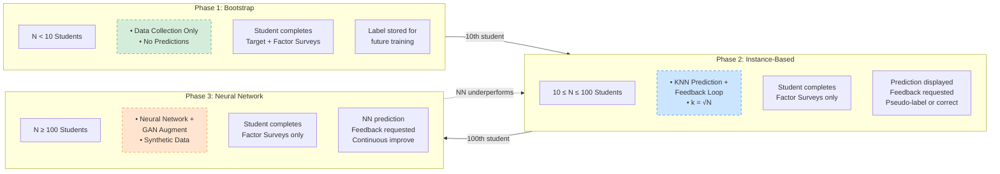
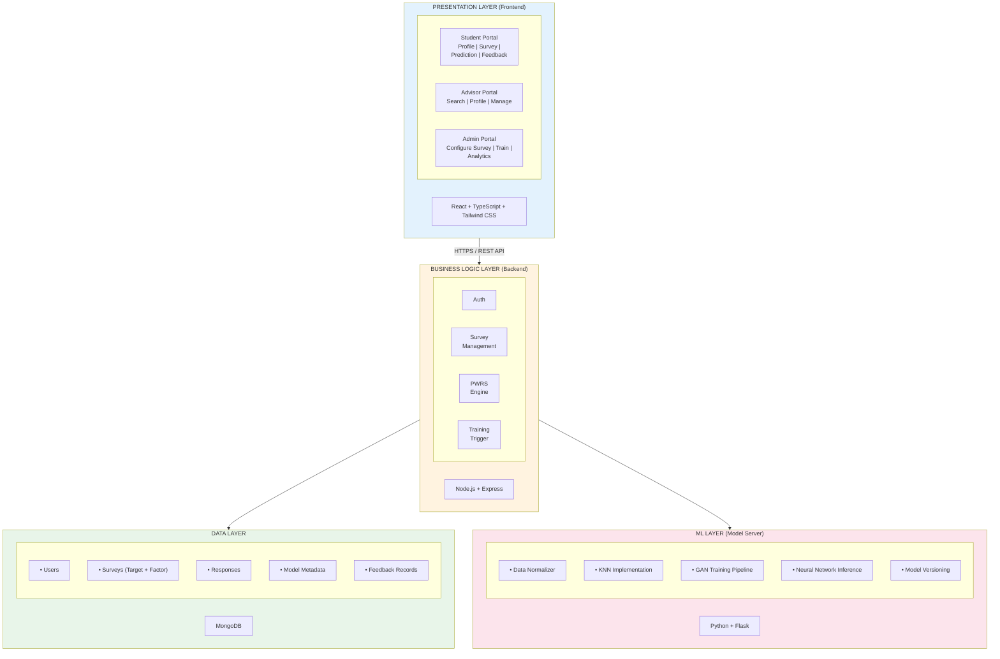

# ACOSUS Paper: Sections 3 and 4

_Sections 3 (System Design and Methodology) and 4 (System Implementation) for CSEDU 2026 submission_

---

## 3 System Design and Methodology

The transfer student population presents unique challenges for predictive analytics. Unlike native cohorts where institutions accumulate thousands of records, departmental programs may enroll fewer than fifty transfer students annually, and critical variables—credit articulation outcomes, transfer shock severity, belonging uncertainty—are rarely captured in institutional data warehouses [2], [5]. To address these constraints, we designed ACOSUS (AI-driven Counseling System for Underrepresented Students), an intelligent advising platform tailored to the "small data" regime inherent in transfer advising.

### 3.1 Architectural Philosophy: Small Data by Design

Traditional educational data mining favors large-scale approaches using registrar feeds and LMS clickstreams [14], but these are poorly suited to transfer advising. Transfer cohorts are inherently small, the variables most predictive of success are seldom captured in standard systems [3], [5], [6], and advisors lack unified access to student information—spending significant time gathering data from disparate sources before providing guidance [8], [17]. ACOSUS addresses these challenges through three design principles: (1) **Immediate Utility**—even before predictions are available, the system provides value through structured data collection; advisors gain immediate access to organized student profiles, and the Bootstrap phase seeds high-quality labeled data for future model training; (2) **Graceful Evolution**—the system transitions seamlessly from data collection to instance-based learning to neural network inference as data accumulates, without manual intervention; and (3) **Burden Minimization**—data collection respects students' time constraints, recognizing that transfer students often juggle employment, family, and academics [6], [12].

### 3.2 The Dual-Survey Architecture

ACOSUS employs a Dual-Survey Architecture separating feature collection from label collection. **Target Surveys** capture the prediction target (success rate) through direct self-assessment or multi-item instruments. **Factor Surveys** collect predictive features: academic background, financial circumstances, logistical factors, technical preparation, and temporal factors. Beyond ML feature vectors, Factor Surveys systematize transfer-specific data collection for advisors—replacing lengthy interviews with structured instruments whose responses appear immediately in advisor dashboards. This dual-purpose design enables cohort comparisons while ensuring no risk factors are overlooked.

**Table 1.** Traditional institutional systems vs. transfer-specific factors captured by ACOSUS.

| Traditional Systems  | Transfer-Specific Factors (ACOSUS)        |
| -------------------- | ----------------------------------------- |
| GPA, courses (SIS)   | Transfer shock severity, credits lost     |
| Financial aid status | Work hours, financial anxiety             |
| LMS engagement       | Social integration, belonging uncertainty |
| Enrollment status    | Institutional fit, career clarity         |

### 3.3 The Progressive Learning Framework

ACOSUS structures predictive intelligence into three phases that activate automatically (Figure 1). In **Phase 1 (Bootstrap, N < 10)**, students complete both surveys to seed the dataset; no predictions are generated, and labels are stored for future training. In **Phase 2 (Instance-Based, 10 ≤ N < 100)**, the system uses K-Nearest Neighbors (k = √N) for prediction; students complete only Factor Surveys, receive predictions, and provide feedback to accept pseudo-labels or trigger ground-truth collection. In **Phase 3 (Neural Network, N ≥ 100)**, GAN-generated synthetic data augmentation enables neural network training, validated exclusively on real data with continuous improvement.

**Figure 1.** The Progressive Learning Framework transitions through three phases as data accumulates. Each phase specifies what students complete, how predictions are generated, and how the system learns from feedback.

### 3.4 Supporting Mechanisms

**Priority-Weighted Response Scoring (PWRS)** aggregates multi-question Target Survey responses into a single success rate through normalized scoring, expert-assigned priority weights, and logistic calibration. **Feedback-Driven Pseudo-Labeling** reduces survey burden: students rate prediction accuracy (1–5 stars), and high ratings (≥4) accept the prediction as a training label, skipping the Target Survey; low ratings trigger ground-truth collection. This reduces burden by an estimated 60–70% while preferentially collecting labels where the model is uncertain. **Feature Normalization** applies type-aware scaling (ordinal, cardinal, continuous, temporal) to a common 0–10 range. **Model Versioning** ensures new models are validated against production baselines before deployment.

---

## 4 System Implementation

ACOSUS is implemented as a three-tier web application separating presentation, business logic, and machine learning concerns, enabling independent scaling and supporting both student-facing prediction and advisor-facing data centralization.

### 4.1 Architecture Overview

The system comprises four primary layers connected through well-defined interfaces (Figure 2). The **Presentation Layer** provides role-specific React interfaces with TypeScript and Tailwind CSS for students (profile, surveys, predictions, feedback), advisors (search, profiles, survey management), and administrators (configuration, training, analytics). The **Business Logic Layer** (Node.js/Express) handles authentication, survey management, PWRS calculation, and training triggers. The **Data Layer** (MongoDB) provides flexible document storage for users, surveys, responses, model metadata, and feedback records. The **ML Layer** (Python/Flask Model Server) handles data normalization, KNN implementation, GAN training pipeline, neural network inference, and model versioning asynchronously, preventing long-running jobs from blocking the application.

**Figure 2.** ACOSUS system architecture showing the separation of concerns across presentation, business logic, data, and machine learning layers.

### 4.2 Technology Stack

**Table 2.** Technology stack for the ACOSUS platform.

| Layer      | Technology                      | Purpose             |
| ---------- | ------------------------------- | ------------------- |
| Frontend   | React, TypeScript, Tailwind CSS | Role-based UI       |
| Backend    | Node.js, Express                | API, business logic |
| Database   | MongoDB                         | Document storage    |
| ML Server  | Python, Flask                   | Training, inference |
| Auth       | JWT                             | Session management  |
| Deployment | Docker, Nginx                   | Containerization    |

### 4.3 Data Flow and Integration

When students complete Factor Surveys, responses flow to MongoDB and simultaneously to the ML Layer for prediction. Students view predictions and submit feedback determining whether pseudo-labels are accepted or ground-truth collection is triggered. Advisors access unified dashboards with student profiles organized by category, enabling quick information retrieval without navigating multiple systems. An "Act-As" capability allows advisors to complete surveys during sessions, with appropriate attribution. The ML Layer processes training jobs asynchronously at administrator-triggered, milestone-based, or scheduled intervals, deploying only models that exceed baseline performance.

---

_End of Sections 3 and 4_
