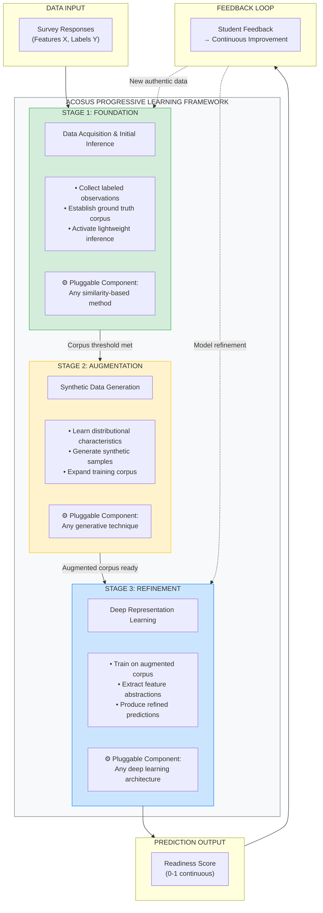
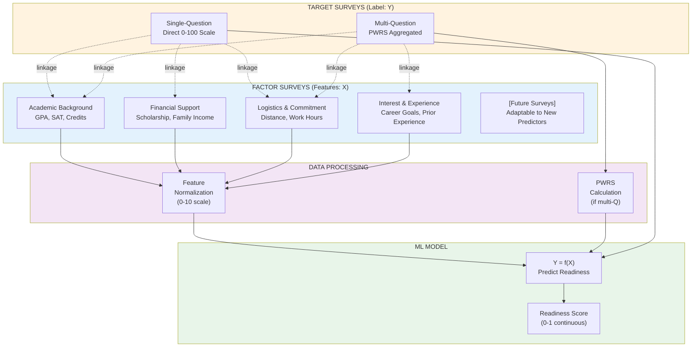
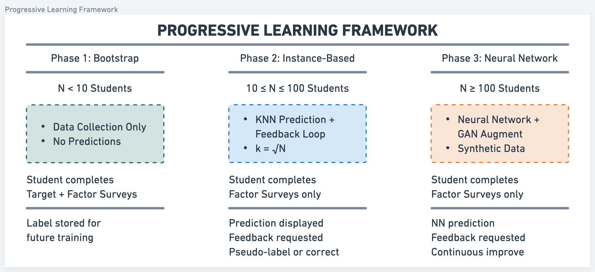
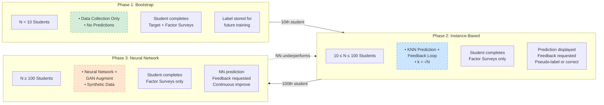
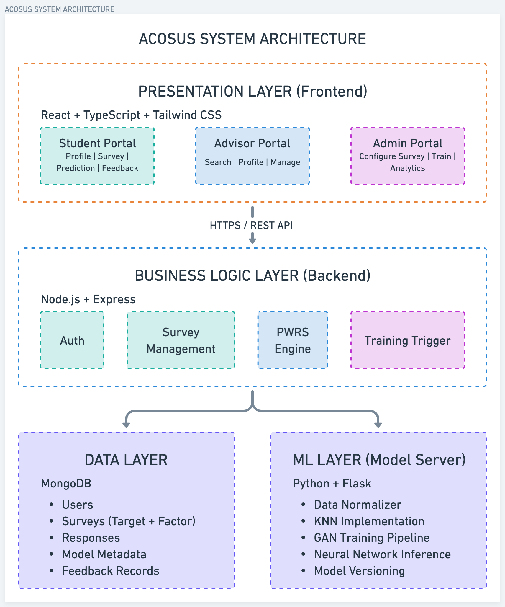
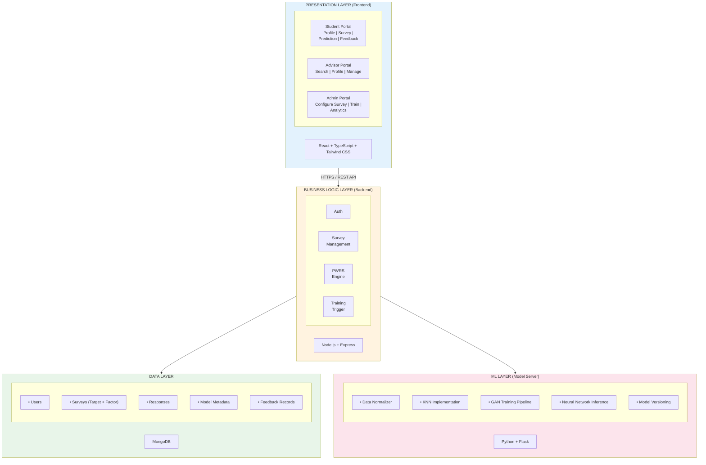

# ACOSUS Paper: Sections 3 and 4

*Sections 3 (System Design and Methodology) and 4 (System Implementation) for CSEDU 2026 submission*

---

## 3 System Design and Methodology

The transfer student population presents a unique challenge for predictive analytics in higher education. Unlike native student cohorts, where institutions accumulate years of historical data and can train sophisticated models on thousands of observations, transfer advising operates under severe data constraints. Departmental programs may enroll fewer than fifty transfer students annually, and the specific combination of pre-transfer trajectories, articulation outcomes, and psychosocial adjustment factors that characterize this population is rarely captured in institutional data warehouses [2], [5]. Consequently, conventional machine learning approaches—which assume abundant labeled training data—are structurally infeasible for transfer-student-specific prediction tasks. To address these constraints, we designed ACOSUS (AI-driven Counseling System for Underrepresented Students), an intelligent advising platform that introduces several architectural innovations tailored to the "small data" regime inherent in transfer student advising.

### 3.1 Architectural Philosophy: Small Data by Design

The dominant paradigm in educational data mining favors large-scale approaches: aggregate registrar feeds, learning management system clickstreams, and institutional research databases containing tens of thousands of student records [14]. Such approaches are poorly suited to transfer-student advising for three reasons. First, transfer cohorts are inherently small—a computing department may admit thirty to fifty transfer students per year, yielding insufficient observations for conventional predictive architectures. Second, conventional deep learning approaches require thousands of labeled samples to achieve reliable performance—fundamentally incompatible with departmental-level enrollment figures. Third, transfer advising requires architectural patterns that can bootstrap predictive capability from minimal observations while improving as more data becomes available.

ACOSUS addresses these challenges through a framework that treats data scarcity not as a limitation to overcome but as a fundamental design constraint to embrace. The architecture ensures the system remains useful throughout its entire lifecycle—from the very first student enrollment, when no predictions are possible, through maturity, when sophisticated models operate on hundreds of observations. In the earliest stages, the system provides value through structured data collection and advisor-facing dashboards; as the corpus grows, predictive capabilities emerge and progressively sophisticate, transitioning automatically through increasingly capable methods. This progression is designed to be sustainable: data collection requirements adapt based on model confidence, ensuring that transfer students—who often balance employment, family, and academic demands [6], [12]—are not overburdened with lengthy surveys.

#### The Three-Stage Progressive Pipeline

To overcome data scarcity, ACOSUS implements a three-stage progressive pipeline that builds predictive capability as observations accumulate. **In the foundation stage**, the system prioritizes collecting high-quality labeled observations through survey instruments that capture both outcomes and predictive features. Once a minimal corpus exists, lightweight similarity-based methods generate initial predictions—this stage emphasizes data quality over prediction sophistication, establishing a reliable foundation for subsequent phases. **As the corpus grows, the augmentation stage** addresses the fundamental small-sample limitation through generative techniques that synthesize additional training observations. These methods learn distributional characteristics from authentic data and produce synthetic samples that expand the training corpus while preserving statistical properties, providing sufficient volume to support more sophisticated algorithms. **Finally, in the refinement stage**, the system transitions to advanced non-linear models capable of capturing complex feature-outcome relationships. Feedback loops enable continuous improvement as new authentic observations arrive, with validation performed exclusively on real data to ensure synthetic augmentation enhances rather than distorts predictive accuracy.

The framework's modularity extends beyond the three-stage progression. Each computational component operates as an interchangeable module: any similarity-based method may serve the foundation stage, any generative technique may perform augmentation, and any deep learning architecture may handle refinement. This algorithm-agnostic design serves two purposes in the small-data context. First, it enables empirical comparison—researchers can evaluate which specific algorithms perform best with limited transfer student observations rather than committing to a fixed approach. Second, it future-proofs the system—as methodological advances emerge in few-shot learning, data augmentation, or neural architecture design, the framework can incorporate improvements without structural modification. ACOSUS is thus positioned not as a specific implementation but as a generalizable framework adaptable to diverse educational prediction contexts.

**Figure 4.** The Three-Stage Progressive Pipeline. Each stage represents a pluggable component that can be substituted with alternative algorithms. The framework progresses from data acquisition through augmentation to refined prediction, with feedback loops enabling continuous improvement.

### 3.2 The Dual-Survey Architecture

The variables most predictive of transfer success—credit articulation outcomes, "transfer shock" severity, belonging uncertainty, and financial precarity—are seldom captured in standard institutional systems [3], [5], [6]. Furthermore, academic advisors lack unified access to the information they need; prior research documents that advisors spend significant time gathering student data from disparate sources before providing meaningful guidance [8], [17]. ACOSUS addresses both challenges through a Dual-Survey Architecture that simultaneously feeds machine learning models and consolidates advisor-facing information.

Prior research on transfer student success has identified multiple dimensions that contribute to successful degree completion, including academic self-efficacy, institutional commitment, social integration, and career goal clarity [2], [3], [5]. Our earlier factor analysis work identified clusters of social-cognitive variables—academic confidence, time management, financial stability, and support systems—that distinguish successful transfer students from those who struggle [REF: 2023 Factor Analysis Paper]. Building on these findings, ACOSUS operationalizes "success" as a **Readiness Score (Y)**—a continuous variable in the range [0, 1] representing the student's self-assessed likelihood of academic success across these dimensions. The system then learns to predict Y from a set of observable features **X** (academic background, financial circumstances, logistical factors) through the function Y = f(X).

ACOSUS implements this predictive framework through a Dual-Survey Architecture that cleanly separates label collection from feature collection. **Target Surveys** capture the dependent variable Y—the readiness/success rate—through two supported modes: (1) a single direct self-assessment question where students rate their readiness on a 0–100 scale, or (2) a multi-question instrument measuring constructs such as academic confidence, commitment, time management self-efficacy, and career motivation, which are aggregated into a single score via Priority-Weighted Response Scoring (Section 3.4). **Factor Surveys** collect the independent variables X used for prediction, organized into categories: academic background (pre-transfer GPA, credits transferred, standardized test scores), financial circumstances (scholarship status, family support, employment intensity), logistical factors (commute distance, work hours), and interest/experience indicators (career aspiration, prior subject experience).

Beyond their role as machine learning feature vectors, Factor Surveys serve a critical function for advisors: they systematize the collection of transfer-specific information that advisors would otherwise gather through lengthy, inconsistent interviews. This dual-purpose design addresses the data fragmentation problem—every transfer student answers the same questions, enabling meaningful cohort-level comparisons while ensuring no critical risk factors are overlooked. Survey responses are immediately available in the advisor dashboard, eliminating the need to search emails, notes, or schedule follow-up conversations.

The system architecture permits flexible study configurations through **survey linkage**, where Target Surveys and Factor Surveys are connected through explicit associations. A single Target Survey (measuring Y) may be linked to multiple Factor Surveys (measuring different feature sets X₁, X₂, X₃), enabling researchers to investigate which feature combinations best predict success. This linkage architecture provides several research advantages: (1) **comparative feature analysis**—researchers can deploy alternative Factor Surveys to the same cohort and compare predictive validity across different feature sets; (2) **longitudinal adaptability**—as research identifies new predictors of transfer success (e.g., post-pandemic factors, emerging transfer shock indicators), new Factor Surveys can be added without disrupting existing data collection or invalidating historical comparisons; (3) **cohort customization**—different academic programs can deploy program-specific Factor Surveys (e.g., technical preparation for computing majors) while maintaining a common outcome measure; and (4) **instrument validation**—multiple Target Survey formulations (single-question vs. multi-question) can be linked to the same Factor Surveys to compare how different operationalizations of success affect prediction accuracy.

**Figure 3.** Dual-Survey Architecture with survey linkage. Target Surveys collect the label (Y), Factor Surveys collect features (X). Dashed lines show linkage relationships enabling flexible study configurations.

**Table 1.** Comparison of data available in traditional institutional systems versus transfer-specific latent factors captured by ACOSUS.

| Traditional Institutional Systems | Transfer-Specific Factors (ACOSUS) |
|-----------------------------------|-----------------------------------|
| GPA, courses (SIS) | Transfer shock severity, credits lost in articulation |
| Financial aid status | Work hours, family support perception, financial anxiety |
| LMS engagement metrics | Social integration, belonging uncertainty |
| Enrollment status | Institutional fit perception, career clarity |

### 3.3 The Progressive Learning Framework

The defining innovation of ACOSUS is its Progressive Learning Framework (Figure 1), which structures the system's predictive intelligence into three developmental phases that activate automatically as data accumulates. In **Phase 1 (Bootstrap, N < 10)**, the system operates in data-collection mode where students complete both Target and Factor Surveys to seed the dataset with high-quality labeled observations; no predictions are generated, and labels are stored for future training. In **Phase 2 (Instance-Based, 10 ≤ N < 100)**, the system transitions to active prediction using K-Nearest Neighbors regression with k = √N; students complete only the Factor Survey, receive a prediction, provide feedback, and either accept the prediction as a pseudo-label or complete the Target Survey for ground-truth correction. In **Phase 3 (Neural Network, N ≥ 100)**, the system enables neural network training augmented by GAN-generated synthetic data to overcome the small-sample limitation, with validation performed exclusively on real student data and continuous model improvement.

**Figure 1.** The Progressive Learning Framework transitions through three phases as data accumulates. Each phase specifies what students complete, how predictions are generated, and how the system learns from feedback.

### 3.4 Priority-Weighted Response Scoring

When Target Surveys employ multiple questions, responses must be aggregated into a single numeric success rate. We developed the Priority-Weighted Response Scoring (PWRS) algorithm, which normalizes each response to a 0–1 scale, applies expert-assigned priority weights reflecting construct importance, computes a weighted average, and transforms the result through a logistic calibration curve that prevents overconfident predictions at the extremes.

### 3.5 Feedback-Driven Pseudo-Labeling

To reduce respondent burden while maintaining data quality, ACOSUS implements a Feedback-Driven Pseudo-Labeling mechanism. After viewing their predicted success rate, students rate the prediction's accuracy on a 1–5 scale. High ratings (≥ 4 stars) indicate agreement, and the prediction is accepted as a training label—the student skips the longer Target Survey. Low ratings (< 4 stars) trigger Target Survey completion for ground-truth correction. This approach reduces survey burden by an estimated 60–70% while preferentially collecting labels for cases where the model is most uncertain or inaccurate.

### 3.6 Feature Normalization

Factor Survey responses encompass diverse data types that must be normalized to a common scale (0–10) before machine learning ingestion. The system employs type-aware normalization: ordinal data uses option weightages directly, cardinal data applies sum-of-selected over sum-of-total scaling, continuous data undergoes min-max normalization with domain-specific bounds, and temporal data applies duration scoring curves informed by literature on optimal time-to-degree trajectories [12].

### 3.7 Model Selection and Deployment

The system maintains model versioning to ensure prediction quality. When a new model is trained, it is validated against the current production model on held-out real student data before deployment; increased model complexity must translate to improved prediction accuracy rather than overfitting.

---

## 4 System Implementation

The ACOSUS platform is implemented as a three-tier web application separating presentation, business logic, and machine learning concerns. This architecture enables independent scaling of each layer and supports the system's dual purpose of serving both student-facing prediction and advisor-facing data centralization.

### 4.1 High-Level Architecture

The system comprises four primary layers connected through well-defined interfaces (Figure 2). The **Presentation Layer** provides role-specific interfaces through a React-based Single Page Application with TypeScript and Tailwind CSS, with distinct portals for students (profile, survey completion, prediction viewing, feedback submission), advisors (student search, unified profile viewing, survey management), and administrators (survey configuration, model training triggers, analytics). The **Business Logic Layer** orchestrates all business logic through a Node.js/Express backend, with core services for authentication, survey management, PWRS calculation, and training triggers. The **Data Layer** uses MongoDB for flexible document storage—users, surveys (Target and Factor), responses, model metadata, and feedback records—accommodating evolving survey instruments without migration overhead. The **ML Layer** operates as a separate Python/Flask service (Model Server) handling computationally intensive tasks: data normalization, KNN implementation, GAN training pipeline, neural network inference, and model versioning—with asynchronous job queues preventing long-running training tasks from blocking the main application.

**Figure 2.** ACOSUS system architecture showing the separation of concerns across presentation, business logic, data, and machine learning layers.

### 4.2 Component Overview

The **Presentation Layer** implements a React-based SPA with TypeScript for type safety and Tailwind CSS for responsive styling; the component-based architecture supports role-specific interfaces while sharing common UI elements, and auto-save functionality prevents data loss during survey completion. The **Business Logic Layer** enforces the Progressive Learning Framework's phase transitions, ensuring students see appropriate interfaces based on current enrollment counts, and orchestrates the feedback-driven pseudo-labeling workflow. The **Data Layer** stores surveys, responses, and model metadata in MongoDB collections with flexible schemas that accommodate researcher-defined survey instruments. The **ML Layer** implements the phase-appropriate prediction algorithm—storing samples for KNN in Phase 2, training GANs and neural networks in Phase 3—with model versioning ensuring that only validated improvements reach production.

### 4.3 Technology Stack

**Table 2.** Technology stack for the ACOSUS platform.

| Layer | Technology | Purpose |
|-------|------------|---------|
| Frontend | React 18, TypeScript, Tailwind CSS | Role-based UI rendering |
| Backend | Node.js 20, Express | API orchestration, business logic |
| Database | MongoDB 7.0 | Flexible document storage |
| ML Server | Python 3.9, Flask | Model training and inference |
| Authentication | JWT | Stateless session management |
| Deployment | Docker, Nginx | Containerization, reverse proxy |

### 4.4 System Integration and Data Flow

Figure 2 illustrates how data flows through the ACOSUS architecture to serve both prediction and advising functions. When a student completes a Factor Survey, responses flow from the React frontend through the REST API to MongoDB for persistence. The backend simultaneously forwards normalized features to the ML Layer's Prediction Service, which loads the appropriate model (KNN samples or neural network weights) and returns a success rate prediction. The student views this prediction and submits feedback, which determines whether the prediction becomes a pseudo-label or triggers Target Survey completion for ground-truth collection.

Advisors access the system through a unified dashboard that queries MongoDB for student profiles organized by category—academic, financial, personal, and survey-derived factors. The tabbed interface mirrors Factor Survey structure, enabling advisors to quickly locate specific information without navigating multiple institutional systems. An "Act-As" capability allows advisors to complete surveys on behalf of students during in-person sessions, with responses attributed appropriately for audit purposes. The system tracks which responses were entered by students versus advisors, maintaining research validity while capturing valuable information shared in conversation.

The ML Layer operates asynchronously from the main application. Training jobs—triggered manually by administrators, automatically at enrollment milestones, or on a scheduled basis—are queued and processed without blocking prediction requests. Upon completion, new models are validated against held-out real student data; only models that meet or exceed baseline performance are deployed, ensuring that the system's predictions remain trustworthy as it evolves.

---

*End of Sections 3 and 4*
