# ACOSUS Technical Architecture Guide

This document provides a technical overview of the ACOSUS (AI-driven Counseling System for Underrepresented Students) platform architecture, data flows, and system design decisions.

---

## 1. System Overview

ACOSUS is a three-tier web application with a separate machine learning service layer. The architecture prioritizes:

- **Separation of Concerns**: UI, business logic, data, and ML are decoupled
- **Scalability**: Each layer can scale independently
- **Flexibility**: Survey instruments can evolve without code changes
- **Progressive Capability**: System delivers value immediately while improving over time

### 1.1 High-Level Architecture

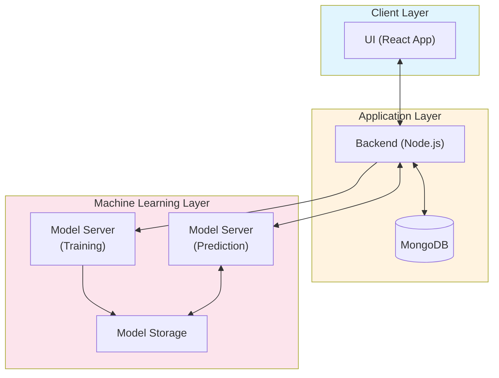

**Figure 1.** High-level system architecture showing the three primary layers.

### 1.2 Component Summary

| Layer | Technology | Responsibility |
|-------|------------|----------------|
| **Client** | React, TypeScript, Tailwind CSS | User interfaces for students, advisors, and administrators |
| **Application** | Node.js, Express, MongoDB | Authentication, survey management, PWRS calculation, API orchestration |
| **ML - Prediction** | Python, Flask | Real-time inference (KNN or Neural Network) |
| **ML - Training** | Python, Flask, TensorFlow | Model training, GAN data generation, validation |

---

## 2. Deployment Architecture

The system is deployed on a dedicated server with containerized services behind an Nginx reverse proxy.

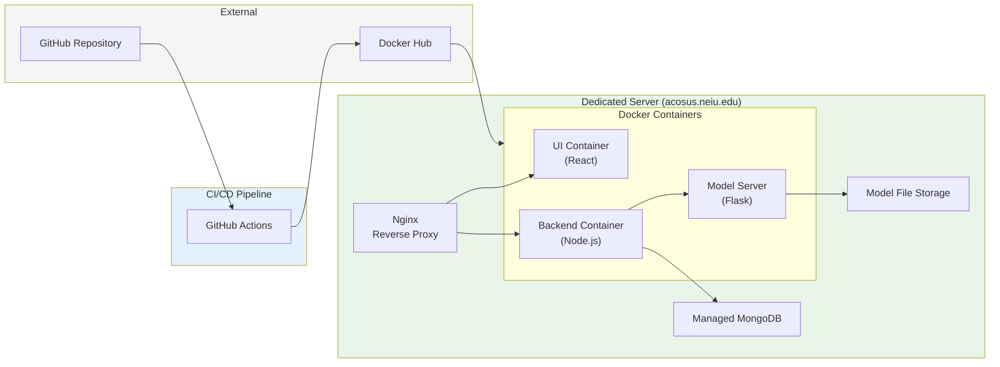

**Figure 2.** Deployment architecture with CI/CD pipeline.

### 2.1 Deployment Flow

1. **Code Push**: Developer pushes to GitHub repository
2. **Build**: GitHub Actions builds Docker images
3. **Registry**: Images pushed to Docker Hub
4. **Deploy**: Updated containers deployed to production server
5. **Routing**: Nginx routes requests to appropriate containers

### 2.2 Container Configuration

| Container | Port | Purpose |
|-----------|------|---------|
| UI (React) | 3000 | Serves static frontend assets |
| Backend (Node.js) | 5000 | REST API, business logic |
| Model Server (Flask) | 8000 | ML predictions and training |

---

## 3. Data Architecture

### 3.1 Database Collections

The MongoDB database stores all application data across interconnected collections.

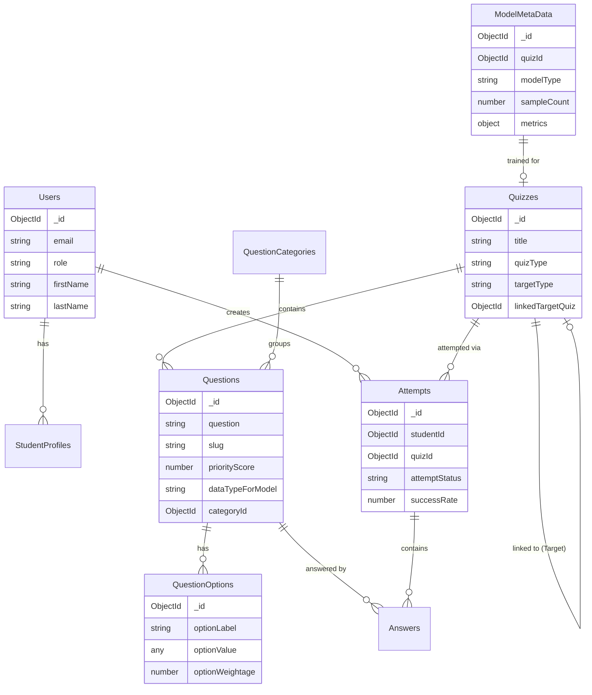

**Figure 3.** Entity-relationship diagram of core database collections.

### 3.2 Key Data Entities

#### Quizzes (Surveys)
- **quizType**: `"target"` or `"factor"` - determines survey purpose
- **targetType**: `"single"` or `"multi"` - for target surveys, determines if single question or multiple questions with PWRS
- **linkedTargetQuiz**: For factor surveys, references which target survey provides the prediction label

#### Questions
- **priorityScore**: 1-10 scale indicating importance for PWRS calculation
- **dataTypeForModel**: `"ordinal"` or `"cardinal"` - determines ML normalization strategy
- **slug**: Unique identifier for answer mapping

#### QuestionOptions
- **optionWeightage**: Numeric value (0-10) representing the "score" for this answer choice
- Used in both PWRS calculation and feature normalization

#### Attempts
- **attemptStatus**: `"in-progress"` or `"completed"`
- **successRate**: Calculated via PWRS (target surveys) or predicted via ML (factor surveys)
- **modifiedBy**: Tracks if student or advisor entered/modified responses

#### ModelMetaData
- Stores trained model configuration per factor survey
- Tracks sample count, model type (KNN/NN), performance metrics
- Enables model versioning and rollback

---

## 4. Application Layer Architecture

### 4.1 Backend Service Structure

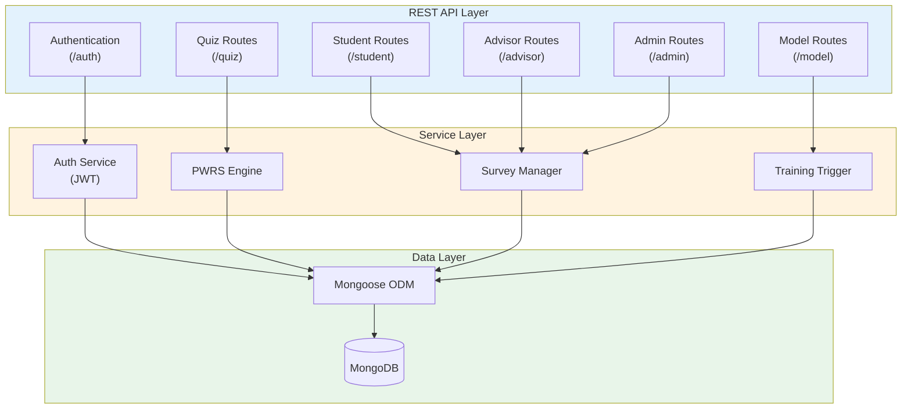

**Figure 4.** Backend service architecture.

### 4.2 API Route Structure

| Route Prefix | Purpose | Key Endpoints |
|--------------|---------|---------------|
| `/auth` | Authentication | Login, register, refresh token |
| `/student` | Student operations | Take surveys, view predictions, submit feedback |
| `/advisor` | Advisor operations | Search students, view profiles, manage surveys |
| `/admin` | Administrative | Create surveys, configure models, view analytics |
| `/quiz` | Survey management | CRUD for quizzes, questions, options |
| `/model` | ML operations | Trigger training, check status, get predictions |

### 4.3 Authentication Flow

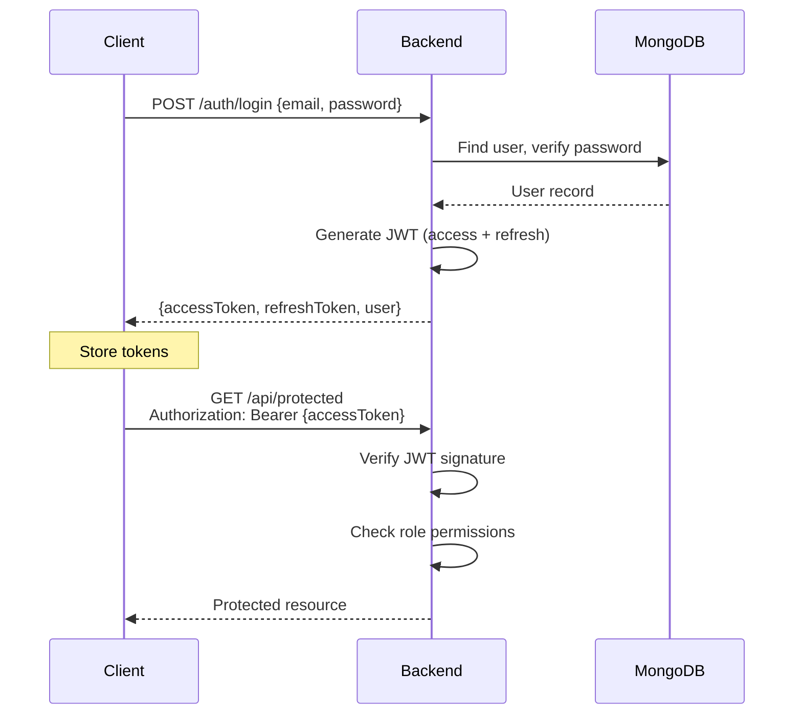

**Figure 5.** JWT authentication flow.

### 4.4 Role-Based Access Control

| Role | Capabilities |
|------|-------------|
| **Student** | Take assigned surveys, view own predictions, provide feedback |
| **Advisor** | Search students, view any student profile, manage surveys, act-as student |
| **Admin** | All advisor capabilities + create surveys, configure models, trigger training |

---

## 5. Frontend Architecture

### 5.1 Portal Structure

The frontend is organized into three distinct portals, each serving a specific user role.

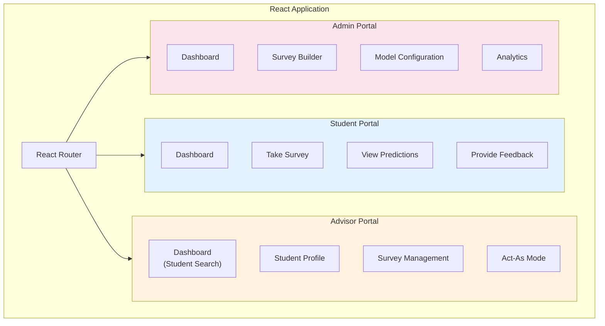

**Figure 6.** Frontend portal structure.

### 5.2 Student Portal Features

| Feature | Description |
|---------|-------------|
| **Survey List** | View assigned surveys with completion status |
| **Survey Taking** | Question-by-question interface with progress tracking |
| **Auto-Save** | Responses saved automatically to prevent data loss |
| **Prediction View** | Display predicted success rate with feedback prompt |
| **Feedback Rating** | 1-5 star rating of prediction accuracy |

### 5.3 Advisor Portal Features

| Feature | Description |
|---------|-------------|
| **Student Search** | Search by name, email, or student ID with filters |
| **Unified Profile** | Tabbed view of student data organized by category |
| **Survey Management** | View attempts, completion status, individual responses |
| **Act-As Capability** | Complete surveys on behalf of students during sessions |
| **Copy & Edit** | Duplicate attempts with modifications for data refinement |

### 5.4 Admin Portal Features

| Feature | Description |
|---------|-------------|
| **Survey Builder** | Create target and factor surveys with questions/options |
| **Question Configuration** | Set priority scores, option weightages, data types |
| **Survey Linkage** | Connect factor surveys to target surveys |
| **Model Training** | Trigger training, view status, compare model versions |
| **Analytics Dashboard** | Completion rates, prediction distributions, feedback scores |

---

## 6. Machine Learning Architecture

### 6.1 Model Server Overview

The ML layer is split into two logical components:

1. **Prediction Server**: Handles real-time inference requests
2. **Training Server**: Handles asynchronous model training jobs

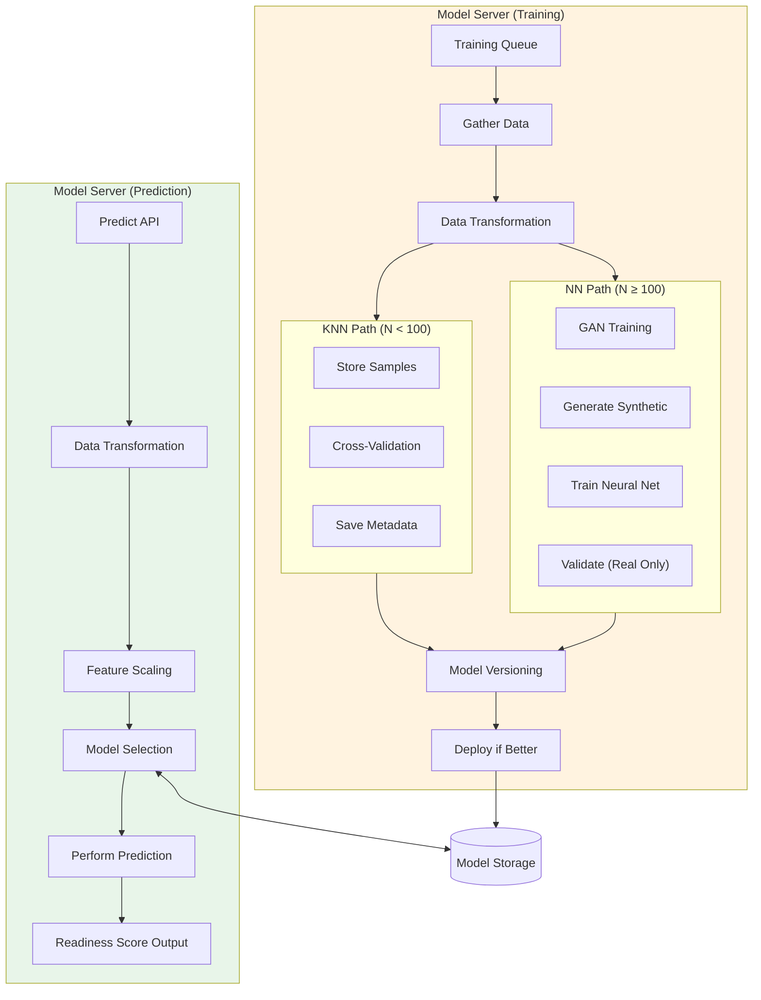

**Figure 7.** Model server architecture showing prediction and training flows.

### 6.2 Prediction Flow

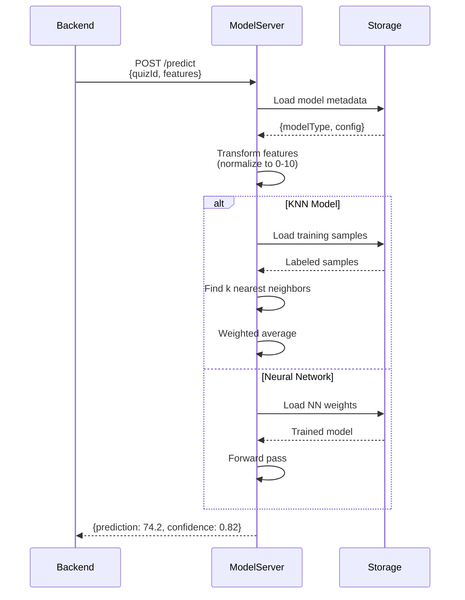

**Figure 8.** Prediction request flow.

### 6.3 Data Transformation Pipeline

All survey responses must be normalized to a common scale (0-10) before ML ingestion.

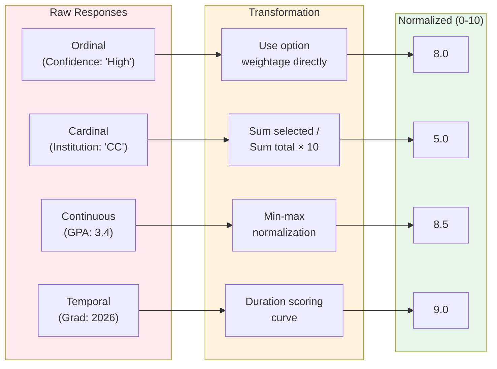

**Figure 9.** Feature normalization pipeline by data type.

### 6.4 Model Selection Logic

The system automatically selects the appropriate model based on available training data.

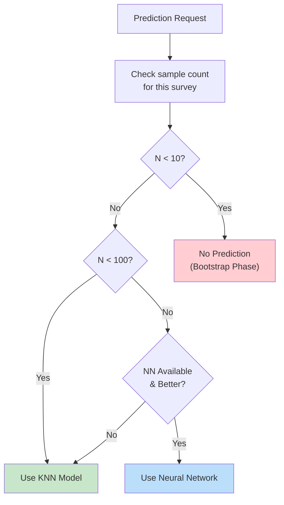

**Figure 10.** Automatic model selection based on data availability.

---

## 7. Progressive Learning Framework

### 7.1 Phase Transitions

The system progresses through three phases as data accumulates.

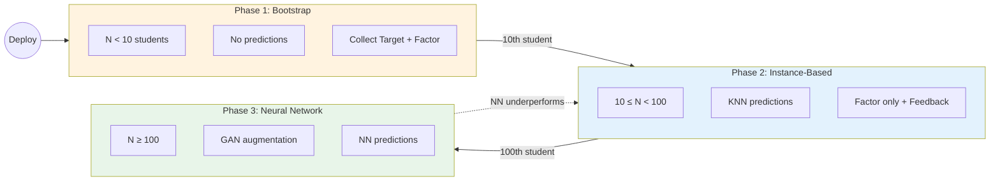

**Figure 11.** Progressive learning phase state diagram.

### 7.2 Phase 1: Bootstrap (N < 10)

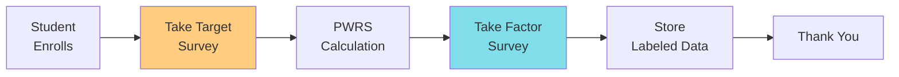

**Figure 12.** Phase 1 student flow—both surveys required.

### 7.3 Phase 2: Instance-Based Learning (10 ≤ N < 100)

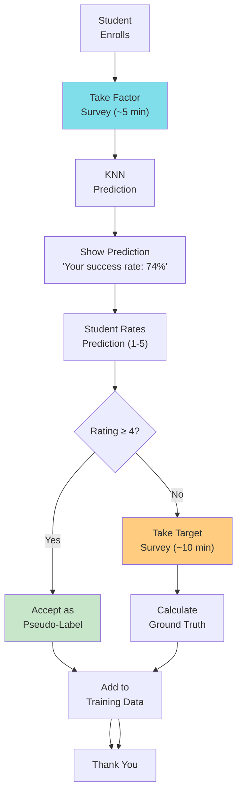

**Figure 13.** Phase 2 student flow with feedback-driven pseudo-labeling.

### 7.4 Phase 3: Neural Network (N ≥ 100)

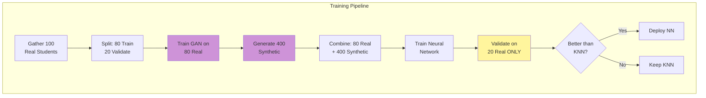

**Figure 14.** Phase 3 GAN-augmented neural network training pipeline.

---

## 8. Survey System Architecture

### 8.1 Survey Types

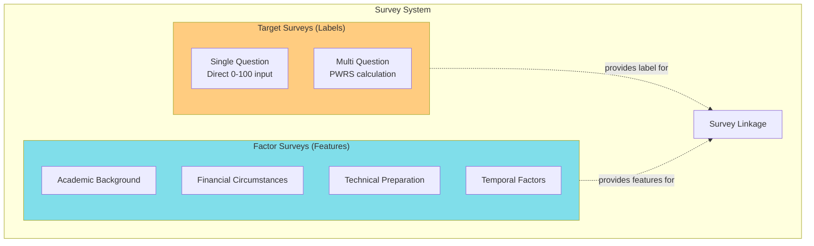

**Figure 15.** Survey type hierarchy.

### 8.2 Question Configuration

Each question has configuration that affects both PWRS calculation and ML feature extraction.

| Field | Purpose | Values |
|-------|---------|--------|
| **priorityScore** | PWRS weighting | 1-10 (higher = more important) |
| **dataTypeForModel** | ML normalization strategy | `"ordinal"` or `"cardinal"` |
| **isRequired** | Completion enforcement | `true` or `false` |
| **categoryId** | UI organization | Reference to category |

### 8.3 Option Configuration

| Field | Purpose | Example |
|-------|---------|---------|
| **optionLabel** | Display text | "Very Confident" |
| **optionValue** | Storage value | "very_confident" |
| **optionWeightage** | Numeric score | 9 (out of 10) |

### 8.4 PWRS Calculation Flow

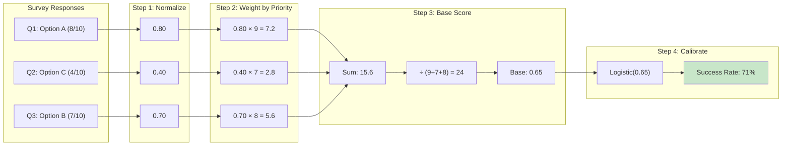

**Figure 16.** PWRS calculation pipeline.

---

## 9. Feedback Loop Architecture

### 9.1 Feedback Collection Flow

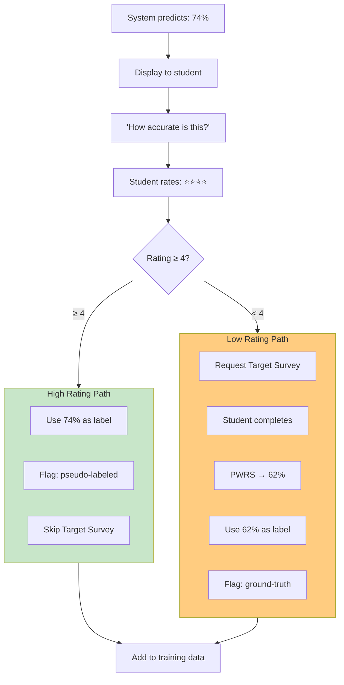

**Figure 17.** Feedback-driven pseudo-labeling decision flow.

### 9.2 Training Data Labels

| Source | Label Type | Usage |
|--------|-----------|-------|
| **Phase 1** | Ground Truth | Student completed Target Survey, PWRS calculated |
| **High Rating (≥4)** | Pseudo-Label | Model prediction accepted by student |
| **Low Rating (<4)** | Ground Truth | Model prediction rejected, Target Survey completed |

### 9.3 Retraining Triggers

| Trigger Type | Condition | Action |
|--------------|-----------|--------|
| **Manual** | Admin clicks "Train Model" | Immediate training job |
| **Milestone** | Every 10 new students | Automatic training job |
| **Scheduled** | Weekly (configurable) | Batch training job |

---

## 10. Advisor Portal Technical Flow

### 10.1 Student Search and Profile View

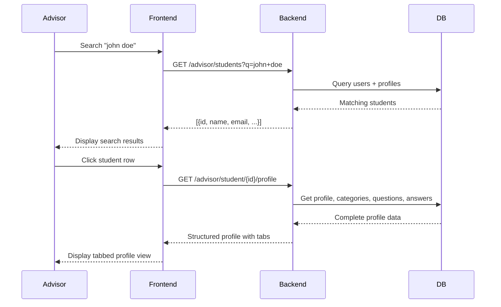

**Figure 18.** Advisor student search and profile retrieval flow.

### 10.2 Act-As Capability

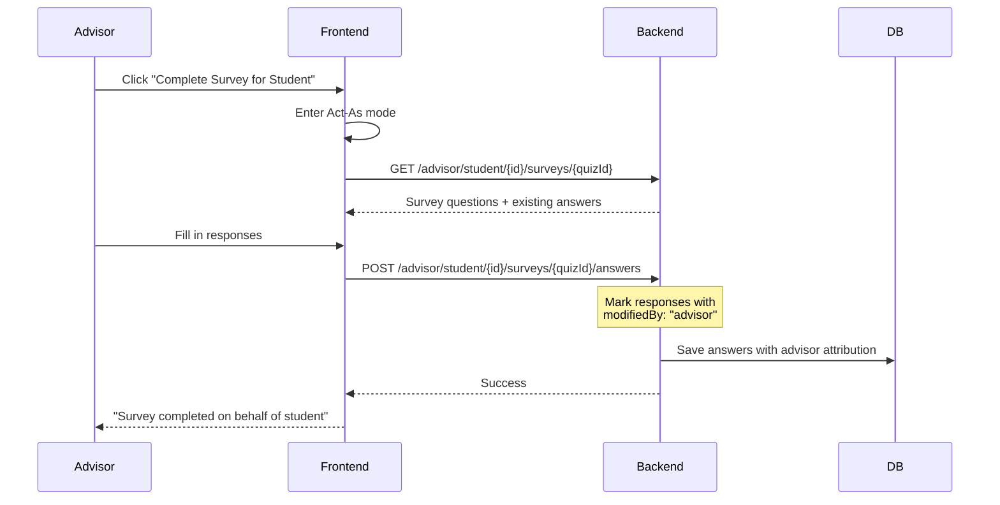

**Figure 19.** Advisor Act-As survey completion flow.

### 10.3 Copy and Edit Workflow

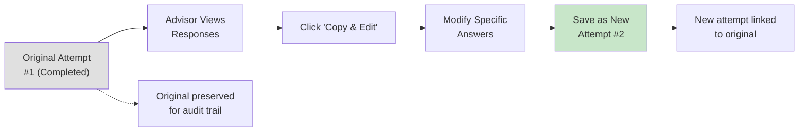

**Figure 20.** Copy and edit workflow for iterative data refinement.

---

## 11. Model Training Pipeline

### 11.1 KNN Training (N < 100)

```mermaid
flowchart TB
    Trigger["Training Triggered"]
    Gather["Gather all labeled samples<br/>for this survey"]
    Store["Store samples in DB<br/>(no model file needed)"]
    Config["Set hyperparameters:<br/>k = min(max(3, √N), 10)<br/>distance = euclidean<br/>weights = distance"]
    Validate["5-fold cross-validation"]
    Check{"Validation<br/>passed?"}
    Meta["Save metadata:<br/>modelId, sampleCount, k, metrics"]
    Retry["Retry with<br/>different params"]

    Trigger --> Gather --> Store --> Config --> Validate --> Check
    Check -->|Yes| Meta
    Check -->|No| Retry --> Config

    style Meta fill:#c8e6c9
```

**Figure 21.** KNN training pipeline—samples stored, not model file.

### 11.2 Neural Network Training (N ≥ 100)

```mermaid
flowchart TB
    Trigger["Training Triggered<br/>(N ≥ 100)"]

    subgraph DataPrep["Data Preparation"]
        Gather["Gather 100 real samples"]
        Split["Split 80/20"]
        Train80["80 for training"]
        Val20["20 for validation"]
    end

    subgraph GANPhase["GAN Phase"]
        TrainGAN["Train GAN on 80 real"]
        Generate["Generate 400 synthetic"]
        ValidateGAN["Validate synthetic quality<br/>(distribution similarity)"]
        GANCheck{"Quality<br/>OK?"}
        StoreSynth["Store synthetic samples"]
        RetryGAN["Retry GAN training"]
    end

    subgraph NNPhase["Neural Network Phase"]
        Combine["Combine: 80 real + 400 synth"]
        TrainNN["Train Neural Network"]
        ValidateNN["Validate on 20 REAL only"]
        Compare{"Better than<br/>current model?"}
        Deploy["Deploy new model"]
        Keep["Keep current model<br/>Log attempt"]
    end

    Trigger --> DataPrep
    Split --> Train80 --> TrainGAN
    Split --> Val20
    TrainGAN --> Generate --> ValidateGAN --> GANCheck
    GANCheck -->|Yes| StoreSynth --> Combine
    GANCheck -->|No| RetryGAN --> TrainGAN
    Combine --> TrainNN --> ValidateNN --> Compare
    Compare -->|Yes| Deploy
    Compare -->|No| Keep

    style Val20 fill:#fff59d
    style ValidateNN fill:#fff59d
    style Deploy fill:#c8e6c9
```

**Figure 22.** Complete neural network training pipeline with GAN augmentation.

### 11.3 Model Versioning

| Field | Description |
|-------|-------------|
| **modelId** | Unique identifier for this training run |
| **quizId** | Which factor survey this model serves |
| **modelType** | `"knn"` or `"neural"` |
| **sampleCount** | Number of real samples used |
| **syntheticCount** | Number of synthetic samples (NN only) |
| **metrics** | Validation performance (MAE, R², etc.) |
| **isActive** | Currently deployed for predictions |
| **createdAt** | Training timestamp |

---

## 12. Integration Points

### 12.1 Backend ↔ Model Server Communication

```mermaid
sequenceDiagram
    participant Backend
    participant ModelServer

    Note over Backend,ModelServer: Prediction Request
    Backend->>ModelServer: POST /predict<br/>{quizId, features: {...}}
    ModelServer-->>Backend: {prediction: 74.2, neighbors: [...]}

    Note over Backend,ModelServer: Training Request
    Backend->>ModelServer: POST /train<br/>{quizId}
    ModelServer-->>Backend: {jobId: "abc123", status: "queued"}

    Note over Backend,ModelServer: Training Status Check
    Backend->>ModelServer: GET /train/status/abc123
    ModelServer-->>Backend: {status: "completed", metrics: {...}}
```

**Figure 23.** Backend to Model Server API communication patterns.

### 12.2 Future Integration: OpenAI API

The architecture supports future integration with language models for personalized guidance generation.

```mermaid
flowchart LR
    Prediction["Prediction: 74%"]
    Factors["Key Factors:<br/>- Low financial support<br/>- High academic confidence"]

    Prompt["Generate Prompt"]
    OpenAI["OpenAI API"]
    Response["Personalized<br/>Guidance Text"]

    Display["Display to<br/>Student/Advisor"]

    Prediction --> Prompt
    Factors --> Prompt
    Prompt --> OpenAI --> Response --> Display

    style OpenAI fill:#e0e0e0,stroke-dasharray: 5 5
    style Response fill:#e0e0e0,stroke-dasharray: 5 5
```

**Figure 24.** Planned OpenAI integration for natural language guidance (future work).

---

## 13. Security Architecture

### 13.1 Authentication & Authorization

| Layer | Mechanism |
|-------|-----------|
| **Transport** | HTTPS/TLS encryption |
| **Authentication** | JWT with access/refresh tokens |
| **Authorization** | Role-based middleware (Student, Advisor, Admin) |
| **Session** | Stateless (token-based) |

### 13.2 Data Protection

| Data Type | Protection |
|-----------|------------|
| **Passwords** | bcrypt hashing |
| **Tokens** | Short-lived access (15 min), longer refresh (7 days) |
| **Student Data** | Role-based access control |
| **Model Data** | Server-side storage only |

---

## 14. Scalability Considerations

### 14.1 Current Architecture

| Component | Scaling Strategy |
|-----------|-----------------|
| **Frontend** | Static assets via CDN (future) |
| **Backend** | Horizontal scaling via container replicas |
| **Database** | MongoDB managed service with auto-scaling |
| **Model Server** | Separate prediction/training to prevent blocking |

### 14.2 Training Queue

Long-running training jobs are managed through a queue system:

1. **Request**: Backend submits training job
2. **Queue**: Job added to training queue
3. **Process**: Training server processes sequentially
4. **Status**: Backend polls for completion
5. **Deploy**: New model deployed if validation passes

This prevents training jobs from blocking prediction requests.

---

## 15. Summary

The ACOSUS architecture is designed around three core principles:

1. **Progressive Capability**: The system delivers value from day one and automatically improves as data accumulates, transitioning from heuristics → KNN → Neural Networks without manual intervention.

2. **Dual Purpose**: Every component serves both the ML prediction goal and the advisor data centralization goal. Factor Surveys are simultaneously feature vectors and structured data collection instruments.

3. **Separation of Concerns**: Clear boundaries between UI, business logic, data storage, and ML enable independent scaling, testing, and evolution of each layer.

The technical architecture supports the research innovations described in the methodology paper while providing a production-ready platform for transfer student advising.
