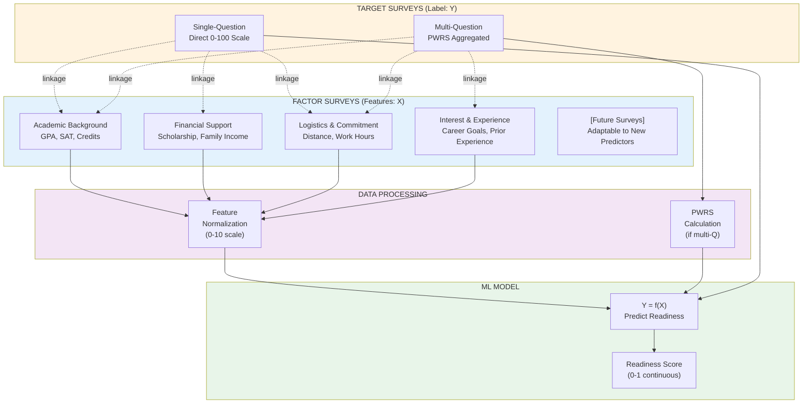
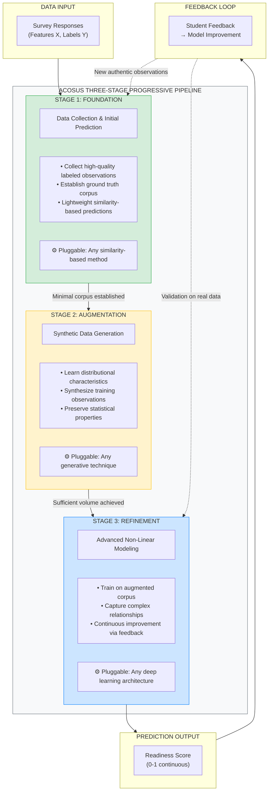

## 3 System Design and Methodology

To address the data constraints and advising challenges outlined in Section 1, we designed ACOSUS (AI-driven Counseling System for Underrepresented Students). This section presents the system's core architectural innovations: a dual-survey architecture that captures transfer-specific variables while supporting advisor workflows (§3.1), and a progressive learning framework designed for the small-data regime inherent in departmental-level transfer advising (§3.2).

### 3.1 The Dual-Survey Architecture

The variables most predictive of transfer success—credit articulation outcomes, "transfer shock" severity, belonging uncertainty, and financial precarity—are seldom captured in standard institutional systems [3], [5], [6]. Furthermore, academic advisors lack unified access to the information they need; prior research documents that advisors spend significant time gathering student data from disparate sources before providing meaningful guidance [8], [17]. ACOSUS addresses both challenges through a Dual-Survey Architecture that simultaneously feeds machine learning models and consolidates advisor-facing information.

Prior research on transfer student success has identified multiple dimensions that contribute to successful degree completion, including academic self-efficacy, institutional commitment, social integration, and career goal clarity [2], [3], [5]. Our earlier factor analysis work identified clusters of social-cognitive variables—academic confidence, time management, financial stability, and support systems—that distinguish successful transfer students from those who struggle [REF: 2023 Factor Analysis Paper]. Building on these findings, ACOSUS operationalizes "success" as representing the student's likelihood of academic success across these dimensions and “factors” as determinant that affects the likelihood. ~~The system then learns to predict Y from a set of observable features X (academic background, financial circumstances, logistical factors) through the function Y = f(X).~~

ACOSUS implements this predictive framework through a Dual-Survey Architecture that cleanly separates label collection from feature collection. Target Surveys capture the success (The measure of success doesn't need to be one-dimensional; a scalar (0 - 1) could be a vector.), through two supported modes: (1) a single direct self-assessment question where students rate their success on a 0–100 scale, or (2) a multi-question instrument measuring constructs such as academic confidence, commitment, time management self-efficacy, and career motivation, which are aggregated into a single score via Weighted Calculation ~~Priority-Weighted Response Scoring (Section 3.4)~~. Factor Surveys collect the independent variables ~~X~~ used for prediction, organized into categories: academic background (pre-transfer GPA, credits transferred, standardized test scores), financial circumstances (scholarship status, family support, employment intensity), logistical factors (commute distance, work hours), and interest/experience indicators (career aspiration, prior subject experience).

Beyond their role as ~~machine learning~~ feature vectors, Factor Surveys serve a critical function for advisors: they systematize the collection of transfer-specific information that advisors would otherwise gather through lengthy, inconsistent interviews. This dual-purpose design addresses the data fragmentation problem—every transfer student answers the same questions, enabling meaningful cohort-level comparisons while ensuring no critical risk factors are overlooked. Survey responses are immediately available in the advisor dashboard, eliminating the need to search emails, notes, or schedule follow-up conversations.

The system architecture permits flexible study configurations through **survey linkage**, where Target Surveys and Factor Surveys are connected through explicit associations. A single Target Survey (measuring Y) may be linked to multiple Factor Surveys (measuring different feature sets X₁, X₂, X₃), enabling researchers to investigate which feature combinations best predict success. This linkage architecture provides several research advantages: (1) **comparative feature analysis**—researchers can deploy alternative Factor Surveys to the same cohort and compare predictive validity across different feature sets; (2) **longitudinal adaptability**—as research identifies new predictors of transfer success (e.g., post-pandemic factors, emerging transfer shock indicators), new Factor Surveys can be added without disrupting existing data collection or invalidating historical comparisons; (3) **cohort customization**—different academic programs can deploy program-specific Factor Surveys (e.g., technical preparation for computing majors) while maintaining a common outcome measure through shared Target Surveys.

**Figure 3.** Dual-Survey Architecture with survey linkage. Target Surveys collect the label, Factor Surveys collect features. Dashed lines show linkage relationships enabling flexible study configurations..

### 3.2 Architectural Philosophy: Small Data by Design

ACOSUS addresses small-data constraints through a framework that treats data scarcity not as a limitation to overcome but as a fundamental design constraint to embrace. The architecture ensures the system delivers value from the very first student enrollment—before any predictions are possible, advisors gain access to structured student profiles through standardized data collection instruments. This immediate utility transforms the cold-start period from a limitation into a productive data-gathering phase. Simultaneously, the framework is designed for sustainability: data collection requirements adapt based on model confidence, ensuring that transfer students—who often balance employment, family, and academic demands [6], [12]—are not overburdened with lengthy surveys.

#### The Three-Stage Progressive Pipeline

As observations accumulate, the system's predictive intelligence matures through a three-stage progressive pipeline. **In the foundation stage**, the system prioritizes collecting high-quality labeled observations through survey instruments that capture both outcomes and predictive features. Once a minimal corpus exists, lightweight similarity-based methods generate initial predictions—this stage emphasizes data quality over prediction sophistication, establishing a reliable foundation for subsequent phases. **As the corpus grows, the augmentation stage** addresses the fundamental small-sample limitation through generative techniques that synthesize additional training observations. These methods learn distributional characteristics from authentic data and produce synthetic samples that expand the training corpus while preserving statistical properties, providing sufficient volume to support more sophisticated algorithms. **Finally, in the refinement stage**, the system transitions to advanced non-linear models capable of capturing complex feature-outcome relationships. Feedback loops enable continuous improvement as new authentic observations arrive, with validation performed exclusively on real data to ensure synthetic augmentation enhances rather than distorts predictive accuracy.

The framework's modularity extends beyond the three-stage progression. Each computational component operates as an interchangeable module: any similarity-based method may serve the foundation stage, any generative technique may perform augmentation, and any deep learning architecture may handle refinement. This algorithm-agnostic design serves two purposes in the small-data context. First, it enables empirical comparison—researchers can evaluate which specific algorithms perform best with limited transfer student observations rather than committing to a fixed approach. Second, as methodological advances emerge in few-shot learning, data augmentation, or neural architecture design, the framework can integrate these improvements without structural modification—positioning ACOSUS not as a fixed implementation but as a generalizable architecture adaptable to diverse educational prediction contexts.

**Figure 4.** The Three-Stage Progressive Pipeline. Each stage represents a pluggable component that can be substituted with alternative algorithms. The framework progresses from data acquisition through augmentation to refined prediction, with feedback loops enabling continuous improvement.
