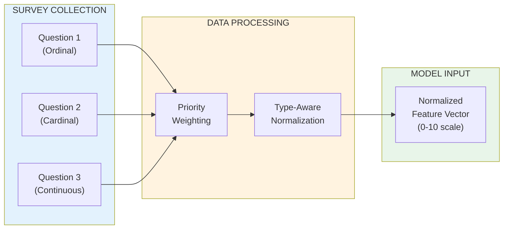
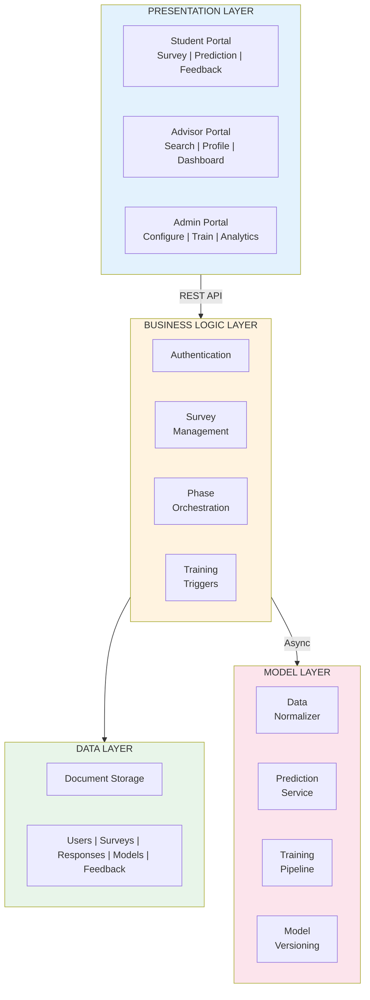

## 3 System Design and Methodology

To address the data constraints and advising challenges outlined in Section 1, we designed ACOSUS (AI-driven Counseling System for Underrepresented Students). This section presents the system's core architectural innovations: a dual-survey architecture that captures transfer-specific variables while supporting advisor workflows (§3.1), and a progressive learning framework designed for the small-data regime inherent in departmental-level transfer advising (§3.2).

### 3.1 The Dual-Survey Architecture

The variables most predictive of transfer success—credit articulation outcomes, "transfer shock" severity, belonging uncertainty, and financial precarity—are seldom captured in standard institutional systems [3], [5], [6]. Furthermore, academic advisors lack unified access to the information they need; prior research documents that advisors spend significant time gathering student data from disparate sources before providing meaningful guidance [8], [17]. ACOSUS addresses both challenges through a Dual-Survey Architecture that simultaneously feeds machine learning models and consolidates advisor-facing information.

Prior research on transfer student success has identified multiple dimensions that contribute to successful degree completion, including academic self-efficacy, institutional commitment, social integration, and career goal clarity [2], [3], [5]. Our earlier factor analysis work identified clusters of social-cognitive variables—academic confidence, time management, financial stability, and support systems—that distinguish successful transfer students from those who struggle [REF: 2023 Factor Analysis Paper]. Building on these findings, ACOSUS operationalizes "success" as representing the student's likelihood of academic success across these dimensions and “factors” as determinant that affects the likelihood. ~~The system then learns to predict Y from a set of observable features X (academic background, financial circumstances, logistical factors) through the function Y = f(X).~~

ACOSUS implements this predictive framework through a Dual-Survey Architecture that cleanly separates label collection from feature collection. Target Surveys capture the success (The measure of success doesn't need to be one-dimensional; a scalar (0 - 1) could be a vector.), through two supported modes: (1) a single direct self-assessment question where students rate their success on a 0–100 scale, or (2) a multi-question instrument measuring constructs such as academic confidence, commitment, time management self-efficacy, and career motivation, which are aggregated into a single score via Weighted Calculation ~~Priority-Weighted Response Scoring (Section 3.4)~~. Factor Surveys collect the independent variables ~~X~~ used for prediction, organized into categories: academic background (pre-transfer GPA, credits transferred, standardized test scores), financial circumstances (scholarship status, family support, employment intensity), logistical factors (commute distance, work hours), and interest/experience indicators (career aspiration, prior subject experience).

Beyond their role as ~~machine learning~~ feature vectors, Factor Surveys serve a critical function for advisors: they systematize the collection of transfer-specific information that advisors would otherwise gather through lengthy, inconsistent interviews. This dual-purpose design addresses the data fragmentation problem—every transfer student answers the same questions, enabling meaningful cohort-level comparisons while ensuring no critical risk factors are overlooked. Survey responses are immediately available in the advisor dashboard, eliminating the need to search emails, notes, or schedule follow-up conversations.

The system architecture permits flexible study configurations through **survey linkage**, where Target Surveys and Factor Surveys are connected through explicit associations. A single Target Survey (measuring Y) may be linked to multiple Factor Surveys (measuring different feature sets X₁, X₂, X₃), enabling researchers to investigate which feature combinations best predict success. This linkage architecture provides several research advantages: (1) **comparative feature analysis**—researchers can deploy alternative Factor Surveys to the same cohort and compare predictive validity across different feature sets; (2) **longitudinal adaptability**—as research identifies new predictors of transfer success (e.g., post-pandemic factors, emerging transfer shock indicators), new Factor Surveys can be added without disrupting existing data collection or invalidating historical comparisons; (3) **cohort customization**—different academic programs can deploy program-specific Factor Surveys (e.g., technical preparation for computing majors) while maintaining a common outcome measure through shared Target Surveys.

**Figure 3.** Dual-Survey Architecture with survey linkage. Target Surveys collect the label, Factor Surveys collect features. Dashed lines show linkage relationships enabling flexible study configurations..

### 3.2 Architectural Philosophy: Small Data by Design

ACOSUS addresses small-data constraints through a framework that treats data scarcity not as a limitation to overcome but as a fundamental design constraint to embrace. The architecture ensures the system delivers value from the very first student enrollment—before any predictions are possible, advisors gain access to structured student profiles through standardized data collection instruments. This immediate utility transforms the cold-start period from a limitation into a productive data-gathering phase. Simultaneously, the framework is designed for sustainability: data collection requirements adapt based on model confidence, ensuring that transfer students—who often balance employment, family, and academic demands [6], [12]—are not overburdened with lengthy surveys.

#### The Three-Stage Progressive Pipeline

As observations accumulate, the system's predictive intelligence matures through a three-stage progressive pipeline. **In the foundation stage**, the system prioritizes collecting high-quality labeled observations through survey instruments that capture both outcomes and predictive features. Once a minimal corpus exists, lightweight similarity-based methods generate initial predictions—this stage emphasizes data quality over prediction sophistication, establishing a reliable foundation for subsequent phases. **As the corpus grows, the augmentation stage** addresses the fundamental small-sample limitation through generative techniques that synthesize additional training observations. These methods learn distributional characteristics from authentic data and produce synthetic samples that expand the training corpus while preserving statistical properties, providing sufficient volume to support more sophisticated algorithms. **Finally, in the refinement stage**, the system transitions to advanced non-linear models capable of capturing complex feature-outcome relationships. Feedback loops enable continuous improvement as new authentic observations arrive, with validation performed exclusively on real data to ensure synthetic augmentation enhances rather than distorts predictive accuracy.

The framework's modularity extends beyond the three-stage progression. Each computational component operates as an interchangeable module: any similarity-based method may serve the foundation stage, any generative technique may perform augmentation, and any deep learning architecture may handle refinement. This algorithm-agnostic design serves two purposes in the small-data context. First, it enables empirical comparison—researchers can evaluate which specific algorithms perform best with limited transfer student observations rather than committing to a fixed approach. Second, as methodological advances emerge in few-shot learning, data augmentation, or neural architecture design, the framework can integrate these improvements without structural modification—positioning ACOSUS not as a fixed implementation but as a generalizable architecture adaptable to diverse educational prediction contexts.

**Figure 4.** The Three-Stage Progressive Pipeline. Each stage represents a pluggable component that can be substituted with alternative algorithms. The framework progresses from data acquisition through augmentation to refined prediction, with feedback loops enabling continuous improvement.

---

## 4 System Implementation

The ACOSUS platform translates the architectural principles described in Section 3 into a functional system. This section details how survey instruments capture and process heterogeneous student data (§4.1), the layered system architecture that supports both prediction and advising workflows (§4.2), and the configuration flexibility that enables researchers to adapt the framework to diverse institutional contexts (§4.3).

### 4.1 Survey Data Processing

The survey instruments described in Section 3.1 synthesize information collected from students into feature vectors suitable for predictive modeling. Each survey question serves as a proxy for an underlying success factor identified in prior research—our factor analysis work established mappings between observable indicators (e.g., scholarship status, commute distance) and latent constructs (e.g., financial stability, institutional commitment) that predict transfer student outcomes [REF: 2023 Factor Analysis Paper]. This literature-grounded design ensures that the data collection process captures theoretically meaningful variables rather than arbitrary demographics.

#### Priority Weighting

Not all factors contribute equally to student success. Research on transfer student outcomes consistently identifies certain variables—academic self-efficacy, financial stability, institutional fit—as more predictive than others [2], [5], [6]. ACOSUS operationalizes this differential importance through **priority scores**: each question receives an expert-assigned weight (1–10 scale) reflecting its relative contribution to the success construct. These priorities are informed by three sources: (1) effect sizes from prior quantitative studies on transfer student persistence, (2) factor loadings from our preliminary factor analysis, and (3) calibration feedback from academic advisors who observe these patterns in practice.

The priority-weighted aggregation follows a straightforward formulation. For a survey with *n* questions, where question *i* has priority score *p_i*, the student selects an option with weightage *w_i^selected* from a maximum possible *w_i^max*:

$$
S = \frac{\sum_{i=1}^{n} \left(\frac{w_i^{selected}}{w_i^{max}} \times p_i\right)}{\sum_{i=1}^{n} p_i}
$$

This yields a normalized score in [0, 1] that accounts for both response quality and question importance. A logistic calibration curve is then applied to prevent overconfident predictions at the extremes.

**Table 2.** Example priority score assignments based on literature-informed importance.

| Factor Category | Example Question | Priority | Rationale |
|-----------------|------------------|----------|-----------|
| Academic Self-Efficacy | "How confident in your ability to succeed?" | 9 | Strong predictor of persistence (Bandura, 1997) |
| Financial Stability | "Expected financial stress impact?" | 8 | Financial precarity affects retention [6] |
| Institutional Commitment | "How committed to completing this program?" | 9 | Persistence indicator (Tinto, 1993) |
| Logistics | "Commute distance to university?" | 6 | Practical barrier, moderate impact |

This priority-weighted approach offers an additional advantage: the weights can serve as informative priors in probabilistic modeling frameworks. When the system transitions to more sophisticated prediction methods, priority scores provide a principled initialization—features with higher priorities receive greater initial influence, which the model can then refine based on observed data. This connection between expert knowledge and learned parameters supports Bayesian inference approaches where priority weights inform prior distributions over feature importance.

#### Data Type Handling

Survey responses encompass heterogeneous data types that require type-aware normalization before model ingestion. The distinction between **ordinal** and **cardinal** data is particularly important: ordinal responses (e.g., "Not confident" < "Somewhat confident" < "Very confident") carry inherent ordering that must be preserved, while cardinal responses (e.g., career aspiration categories) represent nominal distinctions without implied ranking.

**Table 3.** Normalization strategies for different data types.

| Data Type | Example | Normalization Method |
|-----------|---------|---------------------|
| **Ordinal** | GPA range: "3.0–3.5" | Direct option weightage (e.g., 8/10) |
| **Cardinal** | Career: "Industry/Corporate" | Equal weightage or domain-specific mapping |
| **Continuous** | SAT score: 1250 | Min-max scaling: $(x - min)/(max - min)$ |

This type-aware processing ensures that the semantic meaning of responses is preserved during feature engineering—ordinal relationships remain ordered, nominal categories are not spuriously ranked, and continuous values are appropriately scaled.

**Figure 5.** Survey data processing pipeline. Raw responses undergo priority weighting and type-aware normalization to produce standardized feature vectors for model ingestion.

### 4.2 System Architecture

The ACOSUS platform implements a four-layer architecture that separates concerns across presentation, business logic, data persistence, and machine learning (Figure 6). This separation enables independent scaling of each layer and supports the system's dual purpose: serving student-facing predictions while centralizing advisor-facing information.

The **Presentation Layer** provides role-specific interfaces through a web-based single-page application. Students access survey completion workflows, view predictions, and submit feedback. Advisors access a unified dashboard that consolidates student profiles—organized by the same categories as Factor Surveys—eliminating the need to gather information from disparate sources. Administrators configure survey instruments, trigger model training, and monitor system analytics.

The **Business Logic Layer** orchestrates application workflows, enforcing the progressive learning framework's phase transitions and managing the feedback-driven pseudo-labeling process. This layer ensures students encounter appropriate interfaces based on current system state—data collection only during the foundation phase, prediction with feedback during subsequent phases.

The **Data Layer** provides flexible document storage for users, surveys, responses, and model metadata. The schema-flexible design accommodates researcher-defined survey instruments without requiring database migrations as questions evolve.

The **Model Layer** operates as a separate service handling computationally intensive tasks: data normalization, prediction inference across all three pipeline stages, and model training. Asynchronous job queues prevent long-running training tasks from blocking prediction requests. Model versioning ensures that only validated improvements reach production—new models must demonstrate improved accuracy on held-out real student data before deployment.

**Figure 6.** ACOSUS system architecture. Four layers separate presentation, business logic, data persistence, and machine learning concerns, enabling independent scaling and clear separation of responsibilities.

### 4.3 Model Configuration Flexibility

The algorithm-agnostic design described in Section 3.2 manifests in a configuration system that allows researchers to adapt the framework without modifying core infrastructure. Three categories of configuration support this flexibility:

**Phase Transition Thresholds.** Administrators specify the observation counts that trigger transitions between pipeline stages. Default thresholds (foundation → augmentation at N=10, augmentation → refinement at N=100) are based on statistical considerations for the respective algorithm families, but institutions with different enrollment patterns can adjust these boundaries. A computing department expecting 200 transfers annually might lower thresholds; a smaller program might raise them.

**Algorithm Selection.** Each pipeline stage accepts any algorithm conforming to the expected interface. The foundation stage requires a predictor that operates effectively with minimal training data—any similarity-based or instance-based method satisfies this constraint. The augmentation stage requires a generative model capable of synthesizing observations that preserve distributional properties. The refinement stage accepts any supervised learning architecture capable of capturing non-linear relationships. This modularity enables empirical comparison: researchers can evaluate alternative algorithms on their specific student population rather than accepting default choices.

**Hyperparameter Tuning.** Within each algorithm, configurable parameters allow fine-tuning for institutional context. Distance metrics, neighbor counts, generation multipliers, network architectures, and training schedules are all exposed as configuration options. The system logs all configuration choices alongside model performance metrics, enabling systematic comparison across settings.

This configuration flexibility supports the framework's positioning as a generalizable architecture rather than a fixed implementation. As methodological advances emerge—improved few-shot learning techniques, more effective data augmentation strategies, novel neural architectures—institutions can integrate these improvements by updating configuration rather than reengineering the system.

---

*End of Sections 3 and 4*
