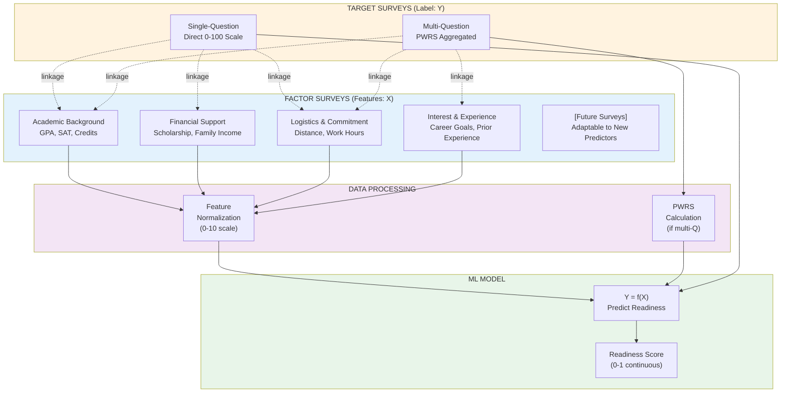
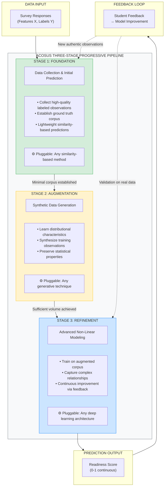
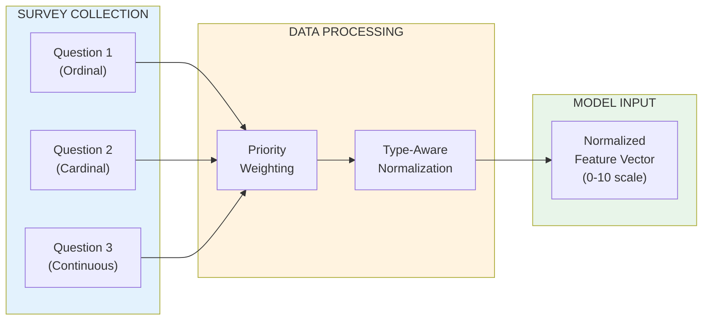
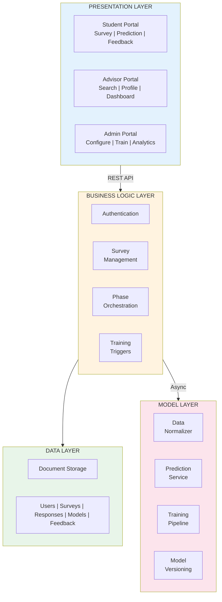

# ACOSUS Research Paper - Mermaid Diagrams for TikZ Conversion

This file contains the Mermaid diagram source code from the research paper for later conversion to TikZ diagrams in LaTeX.

---

## Figure 3: Dual-Survey Architecture with Survey Linkage

**Location in paper:** Section 3.1 (The Dual-Survey Architecture)

**Caption:** Dual-Survey Architecture with survey linkage. Target Surveys collect the label (Y), Factor Surveys collect features (X). Dashed lines show linkage relationships enabling flexible study configurations.



**Color scheme:**
- Target Surveys: Orange background (#fff3e0)
- Factor Surveys: Blue background (#e3f2fd)
- Processing: Purple background (#f3e5f5)
- Output: Green background (#e8f5e9)

---

## Figure 4: The Three-Stage Progressive Pipeline

**Location in paper:** Section 3.2 (Architectural Philosophy: Small Data by Design)

**Caption:** The Three-Stage Progressive Pipeline. Each stage represents a pluggable component that can be substituted with alternative algorithms. The framework progresses from data acquisition through augmentation to refined prediction, with feedback loops enabling continuous improvement.



**Color scheme:**
- Stage 1 (Foundation): Green (#d4edda, border #28a745)
- Stage 2 (Augmentation): Yellow (#fff3cd, border #ffc107)
- Stage 3 (Refinement): Blue (#cce5ff, border #007bff)
- Framework container: Light gray (#f8f9fa, border #6c757d)

---

## Figure 5: Survey Data Processing Pipeline

**Location in paper:** Section 4.1 (Survey Data Processing)

**Caption:** Survey data processing pipeline. Raw responses undergo priority weighting and type-aware normalization to produce standardized feature vectors for model ingestion.



**Color scheme:**
- Collection: Blue background (#e3f2fd)
- Processing: Orange background (#fff3e0)
- Output: Green background (#e8f5e9)

---

## Figure 6: ACOSUS System Architecture

**Location in paper:** Section 4.2 (System Architecture)

**Caption:** ACOSUS system architecture. Four layers separate presentation, business logic, data persistence, and machine learning concerns, enabling independent scaling and clear separation of responsibilities.



**Color scheme:**
- Presentation Layer: Blue (#e3f2fd)
- Business Logic Layer: Orange (#fff3e0)
- Data Layer: Green (#e8f5e9)
- Model Layer: Pink (#fce4ec)

---

## Notes for TikZ Conversion

### General Recommendations:
1. Use `tikz` with the `positioning` library for node placement
2. Use `fit` library for grouping nodes into subgraphs
3. Consider `shapes.geometric` for varied node shapes
4. Use `arrows.meta` for arrow styling

### Color Definitions (LaTeX):
```latex
\definecolor{targetsurvey}{HTML}{fff3e0}
\definecolor{factorsurvey}{HTML}{e3f2fd}
\definecolor{processing}{HTML}{f3e5f5}
\definecolor{output}{HTML}{e8f5e9}
\definecolor{stage1}{HTML}{d4edda}
\definecolor{stage2}{HTML}{fff3cd}
\definecolor{stage3}{HTML}{cce5ff}
\definecolor{modellayer}{HTML}{fce4ec}
```

### Suggested TikZ Style:
```latex
\tikzstyle{surveybox} = [rectangle, rounded corners, minimum width=3cm, minimum height=1cm, text centered, draw=black]
\tikzstyle{arrow} = [thick,->,>=stealth]
\tikzstyle{dashedarrow} = [thick,->,>=stealth,dashed]
```
