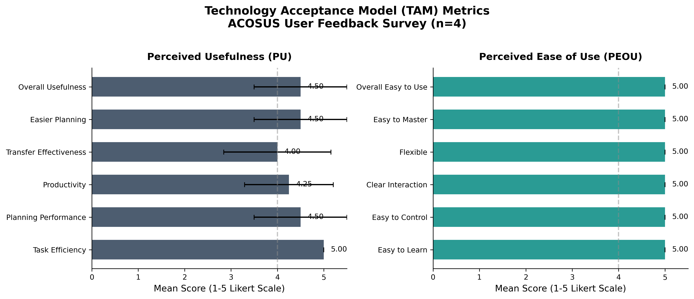
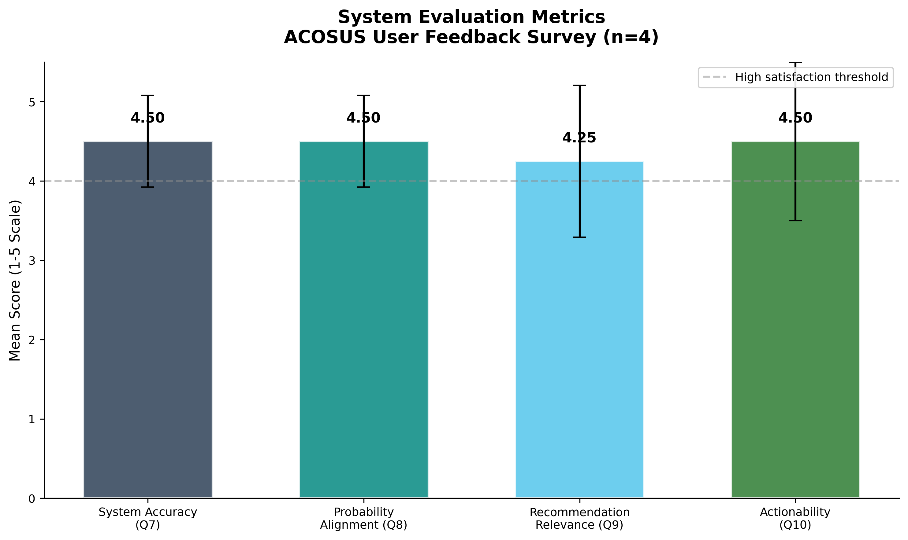
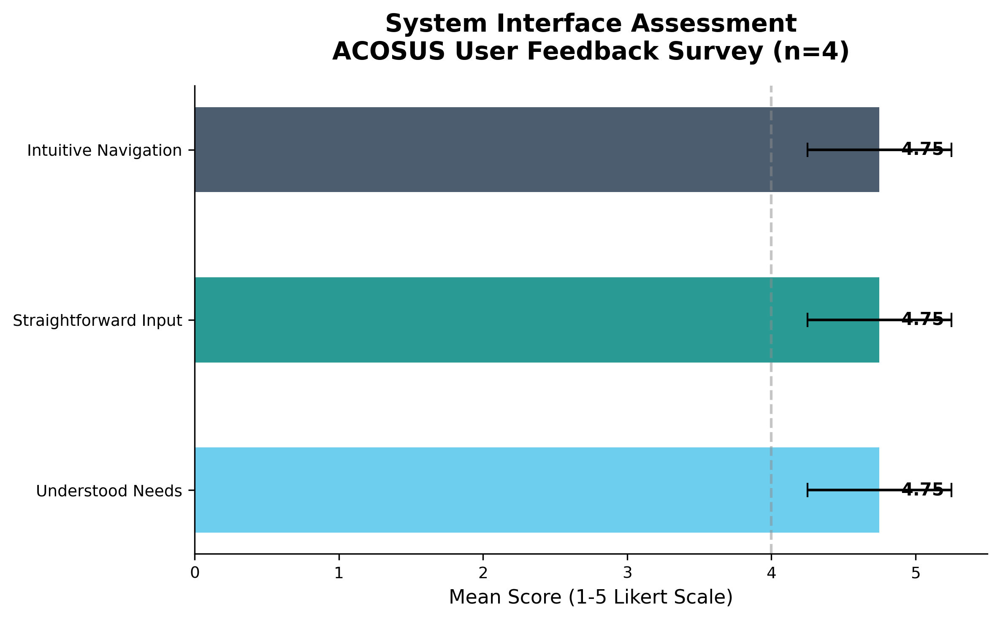
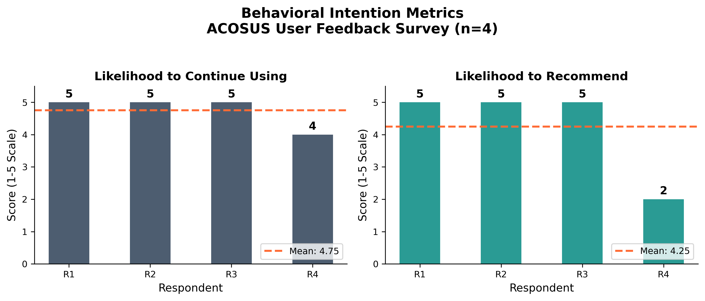
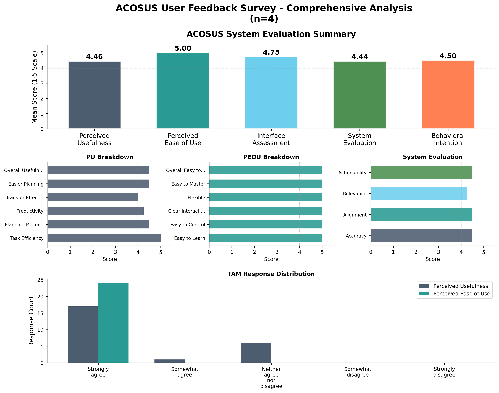
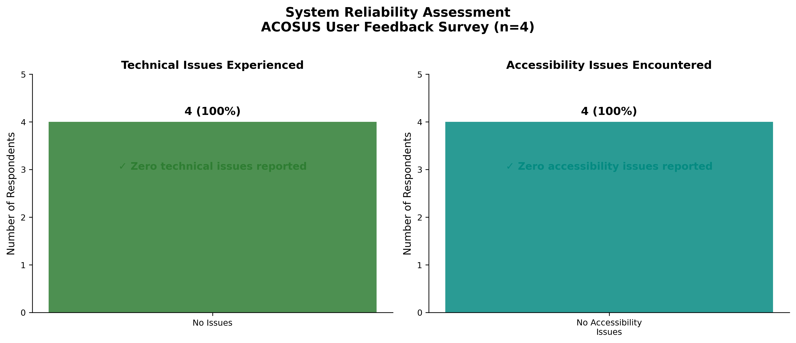
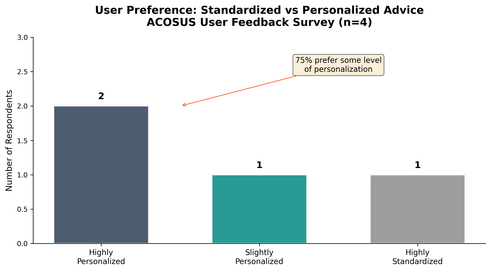
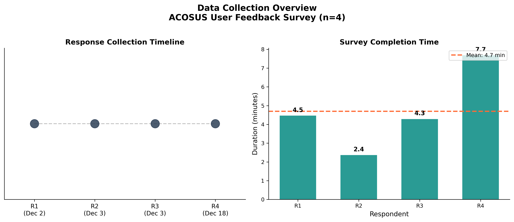
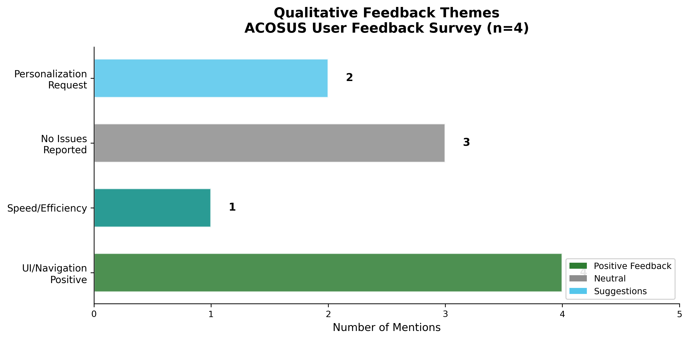

## 5 Evaluation

To assess the usability and perceived value of the ACOSUS platform, we conducted a pilot study with transfer students at a public urban university. This section describes the study design (§5.1), evaluation instruments (§5.2), quantitative results (§5.3), qualitative findings (§5.4), and discusses implications and limitations (§5.5).

### 5.1 Study Design

#### Participants

Four transfer students (N=4) from Northeastern Illinois University participated in the study. Participants were recruited through email invitation and voluntarily enrolled after providing informed consent. All participants were active transfer students in computing-related majors.

#### Procedure

This evaluation was conducted during the foundation phase of the progressive learning pipeline (see Section 3.2), when the system was actively collecting labeled observations to establish the initial training corpus. At this stage, no predictive model had yet been trained—the system's primary function was structured data collection rather than prediction generation.

Participants completed the ACOSUS data collection workflow, which consisted of two phases:

1. **Factor Survey Completion**: Participants completed the Factor Survey instrument capturing academic background, financial circumstances, and logistical factors (see Section 3.1).

2. **Target Survey Completion**: Participants completed a Target Survey providing self-assessed success indicators, which were processed through the priority-weighted aggregation described in Section 4.1 to generate their success label.

Following survey completion, participants completed a post-hoc feedback survey administered through Qualtrics. The feedback survey was designed based on the Technology Acceptance Model (TAM) framework [Davis, 1989] and included additional items assessing system-specific functionality. The study protocol received Institutional Review Board (IRB) approval prior to data collection.

#### Data Collection Period

Data were collected over a 16-day period from December 2–18, 2025. Mean survey completion time was 4.7 minutes (range: 2.4–7.7 minutes).

### 5.2 Evaluation Instruments

#### 5.2.1 ACOSUS Survey Instruments

Participants completed both core ACOSUS instruments prior to the feedback survey:

- **Factor Survey**: 11 questions capturing academic background (GPA, credits transferred), financial circumstances (scholarship status, family support), and logistical factors (commute distance, work hours). All responses were normalized to a 0–10 scale using the type-aware processing described in Section 4.1.

- **Target Survey**: 30 questions (21 active) measuring success-related constructs including academic confidence, institutional commitment, time management self-efficacy, and career motivation. Responses were aggregated via priority-weighted scoring to produce a single readiness label.

#### 5.2.2 TAM-Based Feedback Survey

The post-hoc feedback survey comprised 25 analyzed items across six categories. All Likert-scale items used a 5-point scale unless otherwise noted.

**Table 4.** Feedback survey constructs and items.

| Construct | # Items | Example Item |
|-----------|---------|--------------|
| **Perceived Usefulness (PU)** | 6 | "Using this AI counseling system enables me to accomplish tasks more quickly than other advising methods." |
| **Perceived Ease of Use (PEOU)** | 6 | "Learning to operate this AI counseling system was easy for me." |
| **Interface Assessment** | 3 | "The system interface was intuitive and easy to navigate." |
| **Data Capture Accuracy** | 2 | "How accurate did you find the system's assessment of your academic success factors?" |
| **Survey Quality** | 2 | "How relevant were the questions to your specific situation?" |
| **Behavioral Intention** | 2 | "How likely are you to continue using this system for academic planning?" |

Open-ended questions captured qualitative feedback on interface difficulties, helpful features, missing capabilities, and redesign suggestions.

### 5.3 Quantitative Results

#### 5.3.1 TAM Construct Scores

Analysis of the TAM-based constructs revealed strong positive perceptions across all dimensions.

**Table 5.** Summary statistics for evaluation metrics (5-point Likert scale).

| Metric | Mean | SD | Min | Max |
|--------|------|-----|-----|-----|
| Perceived Usefulness (PU) | 4.46 | 0.85 | 3 | 5 |
| Perceived Ease of Use (PEOU) | 5.00 | 0.00 | 5 | 5 |
| Interface Assessment | 4.75 | 0.50 | 4 | 5 |
| Data Capture Accuracy | 4.50 | 0.58 | 4 | 5 |
| PWRS Alignment | 4.50 | 0.58 | 4 | 5 |
| Survey Relevance | 4.25 | 0.96 | 3 | 5 |
| Actionability | 4.50 | 1.00 | 3 | 5 |
| Likelihood to Continue | 4.75 | 0.50 | 4 | 5 |
| Likelihood to Recommend | 4.25 | 1.50 | 2 | 5 |

**Figure 7.** TAM construct scores. Perceived Ease of Use achieved a perfect score (M=5.00), while Perceived Usefulness showed strong agreement (M=4.46) with slightly more variance.

Perceived Ease of Use achieved a perfect mean score (M=5.00, SD=0.00), indicating that all participants found the system straightforward to learn and operate. Perceived Usefulness was rated highly (M=4.46, SD=0.85), though with greater variance reflecting individual differences in how participants valued the system's utility for their specific situations.

#### 5.3.2 Data Capture and Survey Quality

**Figure 8.** Data capture and survey quality metrics. All dimensions received ratings of 4.25 or higher.

Data Capture Accuracy (M=4.50, SD=0.58) assessed whether the survey instruments adequately captured participants' academic situations. Probability Alignment (M=4.50, SD=0.58) measured whether the priority-weighted success rate calculation (derived from Target Survey responses) resonated with participants' self-perceptions—an important validation given that these calculated scores will serve as training labels. Survey Relevance showed the most variance (M=4.25, SD=0.96), reflecting individual differences in how applicable specific questions were to diverse transfer circumstances. Actionability (M=4.50, SD=1.00) assessed whether participants felt the data collection process provided useful self-reflection about their academic situation.

#### 5.3.3 Interface Assessment

**Figure 9.** Interface assessment. All three interface dimensions received high ratings (M=4.75), with participants particularly endorsing the straightforward input process.

The interface received uniformly positive assessments (M=4.75, SD=0.50). Participants indicated that the system accurately understood their needs as transfer students, the input process was straightforward, and the interface was intuitive to navigate.

#### 5.3.4 Behavioral Intention

**Figure 10.** Behavioral intention. Likelihood to Continue (M=4.75) exceeded Likelihood to Recommend (M=4.25), with the latter showing greater variance.

Likelihood to Continue using the system was high (M=4.75, SD=0.50), suggesting strong personal adoption intent. Likelihood to Recommend showed more variance (M=4.25, SD=1.50), with one participant providing a lower rating (2/5). This discrepancy may reflect individual differences in social recommendation behavior rather than system satisfaction.

#### 5.3.5 Summary Dashboard

**Figure 11.** Comprehensive summary of all evaluation metrics. The radar chart visualizes relative strengths across dimensions, with PEOU emerging as the strongest dimension.

#### 5.3.6 Technical and Accessibility Assessment

**Figure 12.** Technical and accessibility assessment. No participants reported technical issues (0%) or accessibility barriers (0%).

All participants (100%) reported experiencing no technical issues during system use. Similarly, all participants indicated encountering no accessibility barriers, suggesting the interface design successfully accommodated diverse user needs.

#### 5.3.7 Device Usage and Personalization Preferences

**Figure 13.** Device usage. All participants accessed the system via laptop computer (100%).

All participants accessed ACOSUS using laptop computers. This uniform device usage simplifies interpretation of usability results, as interface assessments were not confounded by mobile-specific challenges.

**Figure 14.** Personalization preferences. 75% of participants preferred personalized over standardized advice.

When asked about advice personalization preferences, 75% of participants (n=3) indicated preference for personalized recommendations (2 "highly personalized," 1 "slightly personalized"), while 25% (n=1) preferred "highly standardized" advice. This finding supports the ACOSUS design philosophy of providing individualized guidance based on student-specific factors.

#### 5.3.8 Response Timeline

**Figure 15.** Response timeline. Responses were collected across three distinct dates, with completion times averaging under 5 minutes.

Data collection occurred across three distinct dates, with two responses collected on December 3rd. The mean completion duration of 4.7 minutes indicates that the combined survey experience (Factor + Target + Feedback) remained within acceptable time bounds, supporting the system's goal of reducing survey burden.

### 5.4 Qualitative Findings

Thematic analysis of open-ended responses revealed four primary themes.

**Figure 16.** Qualitative theme distribution. Usability and Satisfaction were the most frequently occurring themes (3 mentions each), followed by Efficiency and Personalization.

**Table 6.** Qualitative themes and representative responses.

| Theme | Count | Representative Quote |
|-------|-------|---------------------|
| **Usability** | 3 | "UI navigation is very user friendly"; "User interface was easy to understand and navigate" |
| **Satisfaction** | 3 | "No feature was missing, experience was great"; "None, everything was clear" |
| **Efficiency** | 1 | "Faster and more compatible" |
| **Personalization** | 1 | "Make it tailored more towards individual users" |

#### Usability Theme

Participants consistently praised the interface design and navigation. One participant noted that "UI navigation is very user friendly," while another stated the "user interface was easy to understand and navigate." These qualitative responses corroborate the quantitative PEOU results (M=5.00).

#### Satisfaction Theme

When asked about missing features or interface difficulties, multiple participants indicated high satisfaction with the current implementation. Responses included "No feature was missing, experience was great" and "None, everything was clear," suggesting the pilot implementation successfully met participant expectations.

#### Efficiency Theme

One participant highlighted system efficiency, noting it was "faster and more compatible" than alternative advising methods. This aligns with the Perceived Usefulness item regarding task completion speed (included in the PU construct).

#### Personalization Theme

One participant suggested the system should "make it tailored more towards individual users and their specific situation." This feedback, combined with the 75% preference for personalized advice (Figure 14), reinforces the importance of the individualized approach central to ACOSUS design.

### 5.5 Discussion and Limitations

#### Key Findings

The pilot study provides preliminary evidence supporting the usability and perceived value of the ACOSUS platform:

1. **Ease of Use**: The perfect PEOU score (M=5.00) and consistent qualitative praise for interface design suggest the system successfully balances functionality with accessibility—a critical requirement for adoption among time-constrained transfer students.

2. **Label Validity**: Probability alignment (M=4.50) ratings indicate that the priority-weighted success rate calculations produced results that resonated with participants' self-assessments. This is critical validation for the foundation phase, as these calculated scores will serve as training labels—participant agreement suggests the PWRS approach generates meaningful ground truth.

3. **Adoption Intent**: High likelihood to continue (M=4.75) suggests participants saw ongoing value in the system, supporting the sustainability of the advising approach.

4. **Technical Stability**: The absence of reported technical or accessibility issues indicates deployment readiness for broader pilot testing.

#### Limitations

Several limitations constrain interpretation of these findings:

**Sample Size**: With N=4, statistical inference is limited. The results represent formative usability feedback rather than generalizable effectiveness claims. Effect sizes and variance estimates are unstable at this sample size.

**Self-Selection Bias**: Participants voluntarily enrolled after email invitation, potentially over-representing students with positive attitudes toward technology-assisted advising.

**Single Institution**: All participants were from one urban public university. Generalizability to other institutional contexts (community colleges, rural institutions, private universities) remains untested.

**Short-Term Assessment**: The study captured immediate post-use perceptions. Longitudinal assessment of actual academic outcomes (GPA changes, persistence, graduation) was beyond the pilot scope.

**No Control Condition**: Without a comparison group using traditional advising, we cannot attribute satisfaction to ACOSUS-specific features versus general positive response to any structured advising interaction.

#### Future Directions

The pilot findings support proceeding to larger-scale evaluation with the following enhancements:

- **Expanded recruitment** across multiple institutions and transfer pathways
- **Longitudinal tracking** of academic outcomes for participants
- **Comparative study design** with traditional advising as control condition
- **Advisor perspective** assessment to evaluate the unified data access value proposition

---

*End of Section 5*
